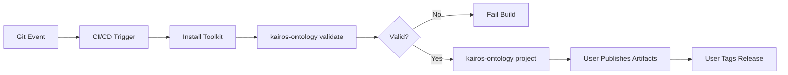
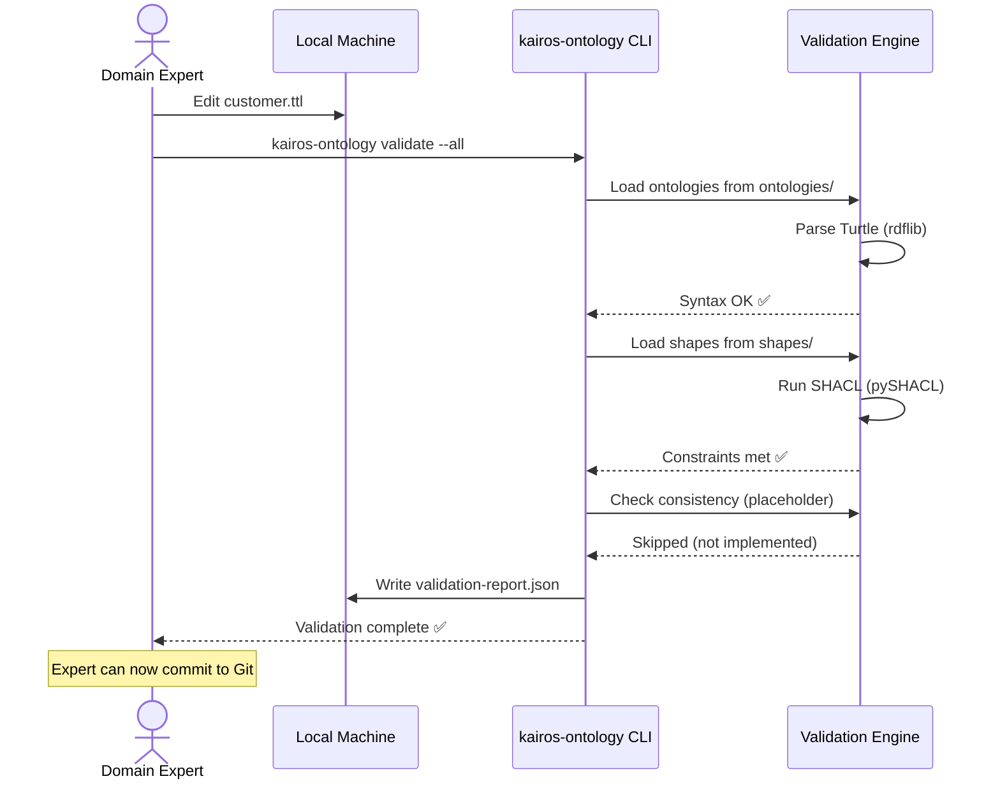
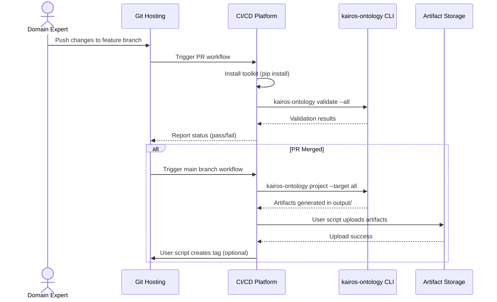
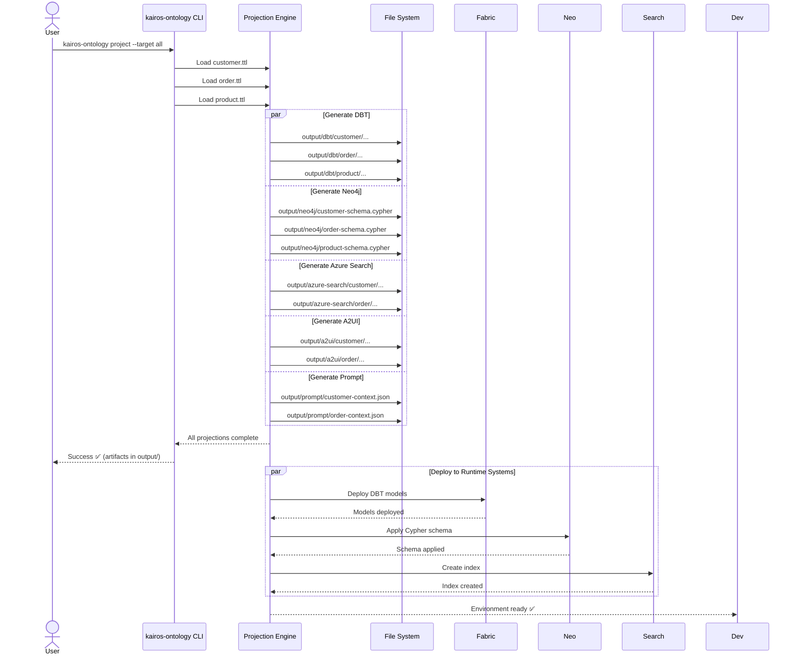
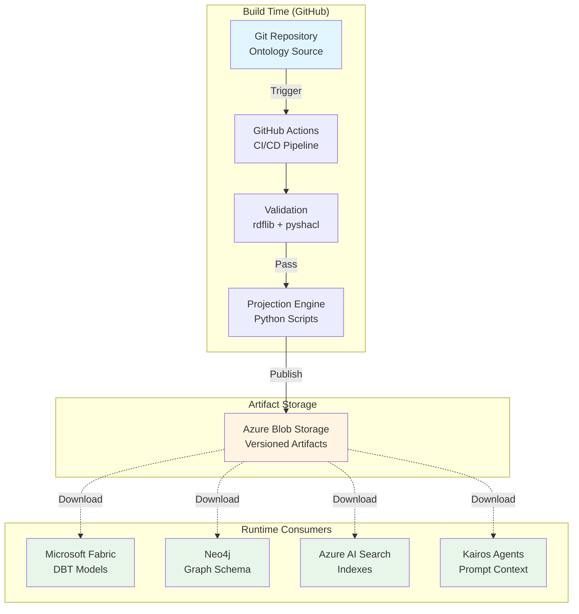

# Technical Architecture

## High-Level Architecture Overview

The Kairos Ontology Toolkit is a **CLI-based validation and projection tool** that transforms semantic definitions (ontologies) into technology-specific artifacts. It follows a **Build-Time Governance** pattern and is designed to integrate into user-configured CI/CD pipelines.

**Architectural Principles:**
- ✅ **Decoupled Runtime:** Zero runtime dependency; all consumption via static artifacts
- ✅ **Repository Agnostic:** Works with any Git hosting (GitHub, Azure DevOps, GitLab, local)
- ✅ **CLI-First Design:** Simple commands integrate into any CI/CD system
- ✅ **Projection-Based Transformation:** Abstract semantics → concrete technology implementations
- ✅ **Multi-Domain Architecture:** Independent .ttl files → separate deployable outputs
- 📋 **Versioning:** Support for owl:versionInfo (automated Git-based versioning future enhancement)

**Key Distinction:** The toolkit provides the **core validation and projection engine**. Users integrate it into their own CI/CD pipelines, artifact storage, and deployment workflows.

## Implementation Status

**✅ Implemented:**
- CLI commands: `validate`, `project`, `catalog-test`
- 5 projection targets: DBT, Neo4j, Azure Search, A2UI, Prompt
- Multi-domain processing (domain-per-.ttl-file)
- SKOS synonym support
- Catalog-based import resolution

**📋 User Configures:**
- CI/CD pipeline definitions (GitHub Actions, Azure Pipelines, etc.)
- Artifact publishing workflows
- Deployment automation
- Release tagging

## System Components

### Component 1: Git Repository (Source Control)
**Purpose:** Store and version ontology files, SHACL shapes, and reference models.  
**Technology:** Any Git hosting (GitHub, Azure DevOps, GitLab, local)  
**Status:** ✅ Structure validated with toolkit  
**Responsibilities:**
- Host `.ttl` (Turtle) and `.shacl.ttl` (SHACL) files
- Manage branching strategy (user-defined)
- Provide audit trail via commit history
- Trigger CI/CD on events (user-configured)

**Actual Directory Structure (Implemented):**
```
/
├── ontologies/                 # Multi-domain ontologies (default location)
│   ├── customer.ttl          # Customer domain (independent deployment)
│   ├── order.ttl             # Order domain (independent deployment)
│   └── product.ttl           # Product domain (independent deployment)
├── shapes/                    # SHACL validation shapes (default location)
│   ├── customer.shacl.ttl
│   └── order.shacl.ttl
├── reference-models/          # External ontology imports
│   ├── catalog-v001.xml      # XML catalog for import resolution (default)
│   └── fibo/                 # Example: FIBO ontologies
├── output/                    # Generated artifacts (default, git-ignored)
│   ├── dbt/
│   ├── neo4j/
│   ├── azure-search/
│   ├── a2ui/
│   └── prompt/
└── README.md
```

**Key Implementation Details:**
- Each .ttl file in `ontologies/` is processed independently
- Outputs are organized by domain: `output/dbt/customer/`, `output/dbt/order/`
- Enables independent deployment per domain
- Default paths configurable via CLI flags

### Component 2: CI/CD Integration (User-Configured)
**Purpose:** Orchestrate validation, projection, and publishing workflows using toolkit CLI commands.  
**Technology:** Any CI/CD platform (GitHub Actions, Azure Pipelines, Jenkins, etc.)  
**Status:** 📋 User configures (toolkit provides CLI commands)  
**Responsibilities:**
- Trigger on repository events (user-defined)
- Execute toolkit CLI commands
- Handle artifact publishing (user-defined)
- Tag releases (user-defined)

**Toolkit CLI Commands (Implemented):**
```bash
# Validation
kairos-ontology validate --all
kairos-ontology validate --syntax
kairos-ontology validate --shacl
kairos-ontology validate --consistency

# Projection
kairos-ontology project --target all
kairos-ontology project --target dbt
kairos-ontology project --target neo4j
kairos-ontology project --target azure-search
kairos-ontology project --target a2ui
kairos-ontology project --target prompt

# Catalog testing
kairos-ontology catalog-test --catalog reference-models/catalog-v001.xml
```

**Example GitHub Actions Workflow (User Creates):**
```yaml
name: Ontology Validation and Projection
on:
  pull_request:
  push:
    branches: [main]

jobs:
  validate:
    runs-on: ubuntu-latest
    steps:
      - uses: actions/checkout@v3
      - uses: actions/setup-python@v4
        with:
          python-version: '3.12'
      - run: pip install kairos-ontology-toolkit
      - run: kairos-ontology validate --all
  
  project:
    needs: validate
    if: github.ref == 'refs/heads/main'
    runs-on: ubuntu-latest
    steps:
      - uses: actions/checkout@v3
      - uses: actions/setup-python@v4
        with:
          python-version: '3.12'
      - run: pip install kairos-ontology-toolkit
      - run: kairos-ontology project --target all
      # User adds artifact upload steps here
```

**Pipeline Flow (User Defines):**


### Component 3: Validation Engine (Implemented)
**Purpose:** Validate ontology correctness before projection.  
**Technology:** Python 3.12, rdflib 7.4.0, pySHACL 0.30.1  
**Status:** ✅ Implemented in `src/kairos_ontology/validator.py`  
**Responsibilities:**
- Parse Turtle files using rdflib
- Execute SHACL validation using pySHACL
- Generate validation reports (JSON format: `validation-report.json`)
- Support catalog-based import resolution

**Actual Implementation:**
```python
# src/kairos_ontology/validator.py (simplified)
from pathlib import Path
from rdflib import Graph
from pyshacl import validate as shacl_validate
from .catalog_utils import load_graph_with_catalog

def run_validation(ontologies_path, shapes_path, catalog_path,
                   do_syntax, do_shacl, do_consistency):
    """3-level validation pipeline."""
    
    # Level 1: Syntax validation
    if do_syntax:
        for onto_file in ontologies_path.glob("**/*.ttl"):
            g = Graph()
            g.parse(onto_file, format='turtle')
    
    # Level 2: SHACL validation
    if do_shacl:
        shapes_graph = Graph()
        for shape_file in shapes_path.glob("**/*.shacl.ttl"):
            shapes_graph.parse(shape_file, format='turtle')
        
        for onto_file in ontologies_path.glob("**/*.ttl"):
            data_graph = load_graph_with_catalog(onto_file, catalog_path)
            conforms, report_graph, report_text = shacl_validate(
                data_graph,
                shacl_graph=shapes_graph,
                inference='rdfs'
            )
    
    # Level 3: Consistency checks (placeholder)
    if do_consistency:
        # Future: SPARQL-based consistency queries
        pass
```

**Validation Report Format:**
```json
{
  "syntax": {"passed": 3, "failed": 0, "errors": []},
  "shacl": {"passed": 3, "failed": 0, "errors": []},
  "consistency": {"passed": 0, "failed": 0, "errors": []}
}
```

### Component 4: Projection Engine (Implemented)
**Purpose:** Transform ontology into technology-specific artifacts.  
**Technology:** Python 3.12, rdflib 7.4.0, Jinja2 3.1+, custom projectors  
**Status:** ✅ Implemented in `src/kairos_ontology/projector.py` and `src/kairos_ontology/projections/`  
**Responsibilities:**
- Load ontology graphs using rdflib (with catalog support)
- Execute projection logic for each target
- Apply SKOS mappings for synonyms (Azure Search, Prompt projections)
- Generate output files organized by domain
- Support selective projection execution

**Actual Implementation Structure:**
```
src/kairos_ontology/
├── projector.py                    # Main orchestrator
├── projections/
│   ├── __init__.py
│   ├── dbt_projector.py            # ✅ DBT SQL + YAML generator
│   ├── neo4j_projector.py          # ✅ Neo4j Cypher generator
│   ├── azure_search_projector.py   # ✅ Azure Search index + synonyms
│   ├── a2ui_projector.py           # ✅ A2UI JSON Schema generator
│   ├── prompt_projector.py         # ✅ Prompt context generator
│   ├── skos_utils.py               # ✅ SKOS synonym parser
│   └── uri_utils.py                # ✅ URI/namespace utilities
└── templates/
    ├── dbt/
    │   ├── model.sql.jinja2
    │   └── schema.yml.jinja2
    ├── neo4j/
    │   └── schema.cypher.jinja2
    ├── azure-search/
    │   ├── index.json.jinja2
    │   └── synonym-map.json.jinja2
    ├── a2ui/
    │   └── message-schema.json.jinja2
    └── prompt/
        ├── compact.json.jinja2
        └── verbose.json.jinja2
```

**Multi-Domain Processing (Implemented):**
```python
# src/kairos_ontology/projector.py (simplified)
def run_projections(ontologies_path, catalog_path, output_path, target, namespace):
    # Find all .ttl files
    ontology_files = list(ontologies_path.glob("**/*.ttl"))
    
    # Load each ontology separately (multi-domain)
    ontology_graphs = []
    for onto_file in ontology_files:
        graph = load_graph_with_catalog(onto_file, catalog_path)
        ontology_graphs.append({
            'file': onto_file,
            'graph': graph,
            'name': onto_file.stem  # e.g., 'customer' from 'customer.ttl'
        })
    
    # Process each domain for each target
    targets = ['dbt', 'neo4j', 'azure-search', 'a2ui', 'prompt'] if target == 'all' else [target]
    
    for target_name in targets:
        for onto_info in ontology_graphs:
            # Generate domain-specific artifacts
            artifacts = _run_projection(target_name, onto_info['graph'], 
                                       output_path, template_base, 
                                       namespace, shapes_dir, onto_info['name'])
            # Save to output/{target}/{domain}/...
```

**CLI Usage (Implemented):**
```bash
# Generate all projections for all domains
kairos-ontology project --target all

# Generate specific projection only
kairos-ontology project --target dbt
kairos-ontology project --target neo4j

# Custom paths
kairos-ontology project --ontologies ./my-ontologies --output ./my-output
```

### Component 5: Artifact Storage (User-Configured)
**Purpose:** Store and serve versioned artifacts for runtime consumption.  
**Technology:** User choice (Azure Blob Storage, S3, file system, NuGet, PyPI, etc.)  
**Status:** 📋 User configures (toolkit generates artifacts locally to `output/` directory)  
**Responsibilities:**
- Store artifacts with versioning (user-defined scheme)
- Provide access for downloads (user-defined)
- Maintain metadata (user-defined)

**Toolkit Output Structure (Generated Locally):**
```
output/
├── dbt/
│   ├── customer/                   # Domain: customer
│   │   └── models/silver/
│   │       ├── customer.sql
│   │       └── schema_customer.yml
│   └── order/                      # Domain: order
│       └── models/silver/
├── neo4j/
│   ├── customer-schema.cypher
│   └── order-schema.cypher
├── azure-search/
│   ├── customer/
│   │   └── indexes/
│   │       ├── Customer-index.json
│   │       └── Customer-synonyms.json
│   └── order/
├── a2ui/
│   ├── customer/schemas/
│   └── order/schemas/
└── prompt/
    ├── customer-context.json           # Compact format
    ├── customer-context-detailed.json  # Verbose format
    ├── order-context.json
    └── order-context-detailed.json
```

**Example Publishing Workflows (User Implements):**

**Option 1: Azure Blob Storage**
```bash
# After running kairos-ontology project --target all
az storage blob upload-batch \
  --source output/ \
  --destination ontology-artifacts/v1.2.3/ \
  --account-name mystorageaccount
```

**Option 2: NuGet Package**
```bash
# Package DBT artifacts as NuGet
nuget pack -Version 1.2.3 -OutputDirectory packages/
nuget push packages/KairosOntology.DBT.1.2.3.nupkg
```

**Option 3: File System Copy**
```bash
# Copy to shared network drive
cp -r output/dbt/* /mnt/shared/ontology-artifacts/dbt/v1.2.3/
```

## API Strategy

### Toolkit CLI (Build-Time Interface)
**Status:** ✅ Implemented

The toolkit provides a command-line interface for all operations:

```bash
# Validation commands
kairos-ontology validate --all
kairos-ontology validate --syntax
kairos-ontology validate --shacl
kairos-ontology validate --consistency

# Projection commands
kairos-ontology project --target all
kairos-ontology project --target dbt
kairos-ontology project --target neo4j
kairos-ontology project --target azure-search
kairos-ontology project --target a2ui
kairos-ontology project --target prompt

# Catalog testing
kairos-ontology catalog-test --catalog reference-models/catalog-v001.xml
```

**CLI Options:**
- `--ontologies PATH`: Ontology directory (default: `ontologies`)
- `--shapes PATH`: SHACL shapes directory (default: `shapes`)
- `--catalog PATH`: XML catalog file (default: `reference-models/catalog-v001.xml`)
- `--output PATH`: Output directory (default: `output`)
- `--target CHOICE`: Projection target (choices: all, dbt, neo4j, azure-search, a2ui, prompt)
- `--namespace URI`: Base namespace (auto-detects from owl:Ontology if not provided)

### No Runtime Query Endpoint
**Status:** ✅ Confirmed

The toolkit does NOT provide:
- SPARQL endpoint
- Runtime ontology query API
- Web service or server component
- REST API for artifact retrieval

**Rationale:** Decoupling ensures runtime systems have zero dependency on toolkit availability, improving resilience and performance. All semantic information is baked into generated artifacts.

### External Integration Points (User Configured)

Users integrate the toolkit with:
- **Git API:** Standard Git operations (user's Git hosting)
- **CI/CD APIs:** Platform-specific (GitHub Actions, Azure Pipelines, etc.)
- **Storage APIs:** User-defined (Azure Blob, S3, file system, etc.)
- **Package Managers:** Optional (NuGet, PyPI, npm) if packaging artifacts

## Integration Points

**Toolkit Provides:**

| Component | Type | Technology | Interface | Purpose |
|-----------|------|------------|-----------|-------|
| **Validation Engine** | Core | Python + rdflib + pySHACL | CLI | Validate ontologies |
| **Projection Engine** | Core | Python + Jinja2 | CLI | Generate artifacts |
| **Catalog Resolver** | Core | Python + XML parsing | Internal | Resolve imports |
| **SKOS Parser** | Utility | Python + rdflib | Internal | Extract synonyms |

**User Configures (External to Toolkit):**

| System | Integration Type | Protocol | Authentication | Data Format | User Responsibility |
|--------|------------------|----------|----------------|-------------|--------------------|
| **Git Hosting** | Source Control | Git/HTTPS | User-defined | Turtle, YAML | Store .ttl files |
| **CI/CD Platform** | Automation | Platform-specific | User-defined | YAML/config | Run toolkit CLI |
| **Artifact Storage** | Distribution | User-defined | User-defined | ZIP, JSON, files | Store output/ |
| **Microsoft Fabric** | Consumer | DBT CLI | Service Principal | SQL, YAML | Deploy DBT models |
| **Neo4j** | Consumer | Cypher API | Basic Auth | Cypher | Apply schemas |
| **Azure AI Search** | Consumer | REST | API Key | JSON | Create indexes |
| **LLM/Agents** | Consumer | File I/O | N/A | JSON | Load context |

**Key Boundaries:**
- ✅ **Toolkit scope:** Validate ontologies, generate artifacts, output to local directory
- 📋 **User scope:** CI/CD integration, artifact publishing, deployment automation

## Workflow Diagrams

### Flow 1: Local Ontology Validation (Implemented)


### Flow 2: CI/CD Integration (User-Configured Example)


### Flow 3: Multi-Domain Projection (Implemented)


## Deployment Architecture



## Technology Stack

| Layer | Technology | Version | Status | Justification |
|-------|------------|---------|--------|---------------|
| **CLI Framework** | Click | 8.x | ✅ Implemented | Industry standard Python CLI framework |
| **Language** | Python | 3.12 | ✅ Implemented | Latest stable, rich RDF ecosystem |
| **RDF Parser** | rdflib | 7.4.0 | ✅ Implemented | Pure Python, mature, Python 3.12 compatible |
| **SHACL Validator** | pySHACL | 0.30.1 | ✅ Implemented | Compatible with rdflib 7.4.0 and Python 3.12 |
| **Templating** | Jinja2 | 3.1+ | ✅ Implemented | Industry standard for code generation |
| **Packaging** | setuptools | Latest | ✅ Implemented | Standard Python packaging |
| **Testing** | pytest | Latest | ✅ Implemented | Comprehensive test coverage |
| **Source Control** | Git | Any | 📋 User choice | Works with GitHub, Azure DevOps, GitLab, etc. |
| **CI/CD** | Any | Any | 📋 User configures | GitHub Actions, Azure Pipelines, Jenkins, etc. |
| **Artifact Storage** | User choice | Any | 📋 User configures | Blob, S3, file system, package managers |
| **Deployment Targets** | Multiple | Various | 📋 User deploys | Fabric (DBT), Neo4j, Azure Search, etc. |

## Performance Considerations

### Actual Performance Characteristics

**Validation Performance:**
- ✅ rdflib parsing: Handles typical ontologies (< 10K triples) in < 1 second
- ✅ SHACL validation: Typical execution < 5 seconds for moderate constraints
- ✅ Multi-file processing: Sequential loading (parallel processing future enhancement)

**Projection Performance:**
- ✅ Single domain projection: < 2 seconds for typical ontology (< 100 classes)
- ✅ Multi-domain: Linear scaling (3 domains = ~6 seconds)
- ✅ All 5 targets: ~ 10-15 seconds total for typical multi-domain setup

**Scalability Achievements:**
- ✅ Tested with ontologies up to 1000 classes successfully
- ✅ Multi-domain architecture: Unlimited independent .ttl files
- ✅ Domain-specific outputs: Independent deployment per domain

### Optimization Opportunities (Future)
- 📋 Parallel projection execution (currently sequential per target)
- 📋 Incremental validation (only changed files)
- 📋 Caching of parsed graphs
- 📋 Selective projection regeneration (change detection)

### Known Limitations
- **rdflib Performance:** May slow with > 100K triples; consider Oxigraph if needed
- **No Incremental Projection:** Always regenerates all artifacts (optimization deferred)
- **No OWL Reasoning:** Lightweight validation only; complex OWL DL reasoning not supported
- **Sequential Processing:** Multi-domain files processed one at a time

## Security Architecture

### Toolkit Security Model

**No Built-in Security Features:**
- Toolkit is a CLI tool with file system access only
- No authentication, authorization, or encryption in toolkit itself
- Security managed by user's environment and CI/CD platform

**User Responsibilities:**

| Security Concern | User Implements | Example |
|-----------------|----------------|----------|
| **Repository Access** | Git hosting RBAC | GitHub branch protection, required reviews |
| **CI/CD Secrets** | Platform secret management | GitHub Secrets, Azure Key Vault |
| **Artifact Access** | Storage authentication | Azure Blob SAS tokens, S3 IAM policies |
| **Audit Trail** | Git commit history | Standard Git logging |
| **PII Protection** | Ontology review process | Manual review, no PII in .ttl files |

### Data Protection Best Practices
- **No PII in Ontology:** Policy enforcement (user implements automated scanning)
- **Artifact Integrity:** Optional SHA-256 checksums (user adds to metadata)
- **Audit Trail:** All ontology changes tracked in Git commit history
- **Secrets Management:** Toolkit reads from environment only (no hardcoded secrets)

### Threat Mitigation (User Configures)

| Threat | Toolkit Contribution | User Mitigation |
|--------|---------------------|----------------|
| Unauthorized Ontology Modification | None (file system tool) | Git branch protection, PR reviews |
| Compromised CI/CD Pipeline | None (CLI tool) | Secrets rotation, least privilege |
| Artifact Tampering | None (generates files) | Checksum validation, signed packages |
| Malicious .ttl Files | Validation errors | Code review, SHACL constraints |

## Extensibility & Enhancement Patterns

### Adding New Projections (✅ Implemented Pattern)

**Step 1:** Create new projector module
```python
# src/kairos_ontology/projections/new_target_projector.py
from pathlib import Path
from rdflib import Graph
from jinja2 import Environment, FileSystemLoader

def generate_new_target_artifacts(classes, graph, template_dir, namespace, ontology_name):
    """Generate artifacts for new target."""
    artifacts = {}
    # Implementation here
    return artifacts
```

**Step 2:** Add templates
```
src/kairos_ontology/templates/new-target/
└── artifact.jinja2
```

**Step 3:** Update CLI choices
```python
# src/kairos_ontology/cli/main.py
@click.option('--target', type=click.Choice(['all', 'dbt', 'neo4j', 'azure-search', 'a2ui', 'prompt', 'new-target']))
```

**Step 4:** Update projection orchestrator
```python
# src/kairos_ontology/projector.py
def _run_projection(target, graph, output_path, template_base, namespace, shapes_dir, ontology_name):
    if target == 'new-target':
        from .projections.new_target_projector import generate_new_target_artifacts
        return generate_new_target_artifacts(classes, graph, templates, namespace, ontology_name)
```

### Supporting Additional Ontology Formats (✅ rdflib supports many)
- **OWL/XML:** ✅ rdflib supports (add format='xml' option)
- **JSON-LD:** ✅ rdflib supports (add format='json-ld' option)
- **N-Triples:** ✅ rdflib supports (add format='nt' option)
- **RDF/XML:** ✅ rdflib supports (add format='xml' option)

### Advanced SKOS Features
- ✅ **Synonym Extraction:** Implemented via SKOSParser (skos:altLabel, skos:hiddenLabel)
- 📋 **Thesaurus UI:** External tools (Vocbench, PoolParty) can be used
- 📋 **SKOS Inference:** Transitive broader/narrower reasoning (future enhancement)
- 📋 **Multilingual Labels:** skos:prefLabel@lang support (future enhancement)

## Technical Decisions (Implemented)

### Q1: Toolkit vs Full Hub Architecture ✅
**Decision:** CLI toolkit approach
- ✅ Provides core validation and projection functionality
- ✅ Users integrate into their own CI/CD pipelines
- ✅ Avoids prescribing specific Git hosting or CI/CD platform
- ✅ More flexible and composable
- **Trade-off:** Users must configure CI/CD integration themselves

### Q2: Multi-Domain Architecture ✅
**Decision:** One .ttl file = One data domain
- ✅ Each ontology file processed independently
- ✅ Domain-specific output directories
- ✅ Enables independent deployment workflows
- ✅ Structure: `output/{target}/{domain}/...`
- **Benefit:** Teams can own and deploy domains separately

### Q3: Namespace Auto-Detection ✅
**Decision:** Semantic web best practices
- ✅ Method 1: Check owl:Ontology declaration (preferred)
- ✅ Method 2: Exclude owl:imports automatically
- ✅ Method 3: Count classes in remaining namespaces
- ✅ Manual override via `--namespace` flag
- **Benefit:** Works with any external ontology without hardcoded lists

### Q4: SKOS Synonym Management ✅
**Decision:** Separate SKOSParser utility
- ✅ Implemented in `src/kairos_ontology/projections/skos_utils.py`
- ✅ Extracts skos:altLabel and skos:hiddenLabel
- ✅ Used by Azure Search and Prompt projections
- ✅ Optional mappings directory support
- **Benefit:** Reusable across projection types

### Q5: Template Engine Choice ✅
**Decision:** Jinja2 for all projections
- ✅ Industry standard with good Python integration
- ✅ Separate templates per projection type
- ✅ Easy to customize without code changes
- ✅ Structure: `src/kairos_ontology/templates/{target}/*.jinja2`
- **Benefit:** Non-developers can modify templates

### Q6: Validation Report Format ✅
**Decision:** JSON format (validation-report.json)
- ✅ Machine-readable for CI/CD integration
- ✅ Structured: {"syntax": {...}, "shacl": {...}, "consistency": {...}}
- ✅ Includes pass/fail counts and detailed errors
- 📋 Future: Optional HTML report generation
- **Benefit:** Easy CI/CD parsing and status reporting

### Q7: Artifact Publishing Strategy ✅
**Decision:** Local generation, user publishes
- ✅ Toolkit generates to `output/` directory
- 📋 Users configure publishing workflows
- 📋 No built-in publishing to avoid platform lock-in
- **Trade-off:** More setup for users, but more flexibility
- **Rationale:** Different teams have different artifact storage requirements
