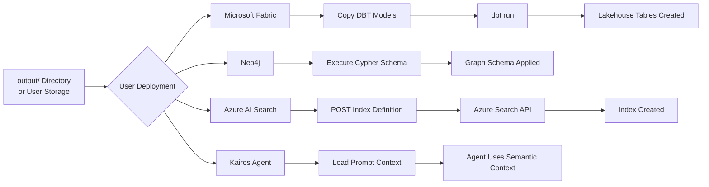

# Data Models & Integration

**Implementation Note:** This document has been updated to reflect the **Kairos Ontology Toolkit** as implemented - a CLI-based build-time tool that generates artifacts locally. Users configure their own integration and deployment workflows.

## Overview
This document defines the domain models, data structures, and integration contracts for the Kairos Ontology Toolkit. Since the Toolkit is a **build-time CLI system**, it does not have runtime data storage or transaction processing. Instead, it defines:
1. **Ontology Domain Model** (the meta-model for semantic definitions)
2. **Artifact Data Structures** (output formats for projections - ✅ all 5 implemented)
3. **Integration Contracts** (how runtime systems consume artifacts - 📋 user implements)

**Toolkit Implementation Status:**
- ✅ Validates ontologies (syntax, SHACL)
- ✅ Projects to 5 targets: DBT, Neo4j, Azure Search, A2UI, Prompt
- ✅ Multi-domain support (separate .ttl files = separate outputs)
- ✅ SKOS synonym extraction for search and AI applications
- ✅ Catalog-based external ontology imports
- 📋 Artifact publishing/deployment (user configures via CI/CD)

---

## Domain Model: Ontology Meta-Model

The Ontology Hub manages semantic definitions using RDF/OWL/SKOS vocabularies. This meta-model defines how ontologies are structured.

### Entity Relationship Diagram

```mermaid
erDiagram
    ONTOLOGY ||--o{ CLASS : contains
    ONTOLOGY ||--o{ PROPERTY : contains
    ONTOLOGY ||--o{ SHACL_SHAPE : validates
    ONTOLOGY ||--o{ SKOS_CONCEPT : references
    
    CLASS ||--o{ PROPERTY : has
    CLASS ||--o{ CLASS : subClassOf
    CLASS }o--o{ CLASS : disjointWith
    
    PROPERTY ||--|| CLASS : hasDomain
    PROPERTY ||--|| CLASS : hasRange
    PROPERTY ||--o{ PROPERTY : subPropertyOf
    
    SHACL_SHAPE ||--|| CLASS : targetClass
    SHACL_SHAPE ||--o{ CONSTRAINT : defines
    
    SKOS_CONCEPT ||--o{ SKOS_CONCEPT : broader
    SKOS_CONCEPT ||--o{ SKOS_CONCEPT : narrower
    SKOS_CONCEPT ||--o{ SKOS_CONCEPT : related
    SKOS_CONCEPT }o--o{ CLASS : exactMatch

    ONTOLOGY {
        string namespace
        string version
        string title
        string description
        date createdAt
        date modifiedAt
    }
    
    CLASS {
        string uri
        string label
        string comment
        string type
    }
    
    PROPERTY {
        string uri
        string label
        string comment
        string propertyType
    }
    
    SHACL_SHAPE {
        string uri
        string targetClass
    }
    
    CONSTRAINT {
        string type
        string value
        string message
    }
    
    SKOS_CONCEPT {
        string uri
        string prefLabel
        array altLabels
        array hiddenLabels
        string definition
    }
```

### Core Entities

#### Entity: Ontology
Represents the top-level ontology document.

| Field | Type | Constraints | Description |
|-------|------|-------------|-------------|
| namespace | URI | NOT NULL, UNIQUE | Ontology namespace (e.g., `http://kairos.ai/ont/core#`) |
| version | String | SEMVER format | Semantic version (e.g., `1.2.3`) |
| title | String | NOT NULL | Human-readable name |
| description | Text | - | Purpose and scope |
| createdAt | DateTime | NOT NULL | Initial creation timestamp |
| modifiedAt | DateTime | NOT NULL | Last modification timestamp |
| imports | Array[URI] | - | Imported external ontologies |

#### Entity: Class (OWL Class)
Represents a concept in the domain model.

| Field | Type | Constraints | Description |
|-------|------|-------------|-------------|
| uri | URI | PK, NOT NULL | Unique identifier (e.g., `http://kairos.ai/ont/core#Customer`) |
| label | String | NOT NULL | Human-readable name (rdfs:label) |
| comment | Text | - | Definition/description (rdfs:comment) |
| type | Enum | owl:Class | Class type indicator |
| subClassOf | Array[URI] | - | Parent classes |
| disjointWith | Array[URI] | - | Mutually exclusive classes |

#### Entity: Property (OWL Property)
Represents attributes or relationships in the domain model.

| Field | Type | Constraints | Description |
|-------|------|-------------|-------------|
| uri | URI | PK, NOT NULL | Unique identifier (e.g., `http://kairos.ai/ont/core#hasCustomer`) |
| label | String | NOT NULL | Human-readable name |
| comment | Text | - | Definition/description |
| propertyType | Enum | DatatypeProperty, ObjectProperty | Property classification |
| domain | URI | - | Expected subject class |
| range | URI | - | Expected value type/class |
| subPropertyOf | Array[URI] | - | Parent properties |

#### Entity: SHACL Shape
Defines validation constraints for classes.

| Field | Type | Constraints | Description |
|-------|------|-------------|-------------|
| uri | URI | PK, NOT NULL | Shape identifier |
| targetClass | URI | NOT NULL | Class this shape validates |
| constraints | Array[Constraint] | - | List of constraints |

#### Entity: Constraint (SHACL Constraint)

| Field | Type | Constraints | Description |
|-------|------|-------------|-------------|
| type | Enum | minCount, maxCount, datatype, pattern, in, class | Constraint type |
| value | Any | - | Constraint value (e.g., minCount=1) |
| message | String | - | Error message if violated |
| severity | Enum | Violation, Warning, Info | Severity level |

#### Entity: SKOS Concept
Represents synonyms and conceptual alignments.

| Field | Type | Constraints | Description |
|-------|------|-------------|-------------|
| uri | URI | PK, NOT NULL | Concept identifier |
| prefLabel | String | NOT NULL | Preferred label |
| altLabels | Array[String] | - | Alternative labels (synonyms) |
| hiddenLabels | Array[String] | - | Search-only labels |
| definition | Text | - | Concept definition (skos:definition) |
| broader | Array[URI] | - | Parent concepts |
| narrower | Array[URI] | - | Child concepts |
| related | Array[URI] | - | Related concepts |
| exactMatch | Array[URI] | - | Equivalent concepts in external ontologies |
| closeMatch | Array[URI] | - | Similar concepts in external ontologies |

## Artifact Data Structures

**Implementation Note:** The toolkit generates artifacts in the `output/` directory, organized by target and domain. Each domain (.ttl file) produces separate output files. Metadata is embedded in generated artifacts rather than separate metadata.json files.

### Output Directory Structure (Actual Implementation)
```
output/
  dbt/
    customer/          # From customer.ttl
      model.sql
      schema.yml
    order/             # From order.ttl
      model.sql
      schema.yml
  neo4j/
    customer/
      schema.cypher
    order/
      schema.cypher
  azure-search/
    customer/
      index.json
      synonym-map.json
    order/
      index.json
  a2ui/
    customer/
      message-schema.json
    order/
      message-schema.json
  prompt/
    customer/
      compact.json
      verbose.json
    order/
      compact.json
      verbose.json
```

### Artifact: metadata.json
**Status:** 📋 NOT IMPLEMENTED - Metadata embedded in artifacts instead

Originally planned as separate file, but actual implementation embeds metadata comments/properties in each artifact:
- DBT: Comments in SQL/YAML with ontology URI
- Neo4j: Comments in Cypher scripts
- Azure Search: `meta` field in JSON
- A2UI: `$schema` and `title` in JSON
- Prompt: Top-level `ontology` object in JSON

### Artifact: DBT Model (SQL)
**File:** `output/dbt/{domain}/model.sql`
**Status:** ✅ IMPLEMENTED

**Implementation Note:** The toolkit generates DBT models focused on **Silver layer** (curated data models). Templates use Jinja2 for flexibility.

```sql
-- Generated from ontology: http://kairos.ai/ont/core#Customer
-- Generated by: Kairos Ontology Toolkit
-- Template: dbt/model.sql.jinja2

{{ config(
    materialized='table',
    schema='silver',
    tags=['ontology-generated', 'core']
) }}

SELECT
    id,
    name,
    email,
    created_at,
    updated_at
FROM {{ source('bronze', 'raw_customers') }}
WHERE is_valid = true
```

### Artifact: DBT Schema YAML
**File:** `output/dbt/{domain}/schema.yml`
**Status:** ✅ IMPLEMENTED

```yaml
# Generated from ontology: http://kairos.ai/ont/core#
# Generated by: Kairos Ontology Toolkit
version: 2

models:
  - name: customer
    description: "Customer entity from core ontology"
    meta:
      ontology_uri: "http://kairos.ai/ont/core#Customer"
    
    columns:
      - name: id
        description: "Unique customer identifier"
        tests:
          - unique
          - not_null
        meta:
          ontology_property: "http://kairos.ai/ont/core#customerId"
      
      - name: email
        description: "Customer email address"
        tests:
          - unique
          - not_null
        meta:
          ontology_property: "http://kairos.ai/ont/core#email"
      
      - name: name
        description: "Customer full name"
        tests:
          - not_null
```

**Implementation Notes:**
- SHACL constraints converted to DBT tests (sh:minCount → not_null)
- Template: `src/kairos_ontology/templates/dbt/model.sql.jinja2`, `schema.yml.jinja2`
- Supports custom configuration via template customization

### Artifact: Neo4j Schema (Cypher)
**File:** `output/neo4j/{domain}/schema.cypher`
**Status:** ✅ IMPLEMENTED

```cypher
// Generated from ontology: http://kairos.ai/ont/core#
// Generated by: Kairos Ontology Toolkit
// Template: neo4j/schema.cypher.jinja2

// Node Labels from OWL Classes
CREATE CONSTRAINT customer_id IF NOT EXISTS
FOR (n:Customer) REQUIRE n.id IS UNIQUE;

CREATE CONSTRAINT order_id IF NOT EXISTS
FOR (n:Order) REQUIRE n.id IS UNIQUE;

// Relationship Types from OWL Object Properties
// (Applied via data loading; no explicit CREATE CONSTRAINT for relationships)
// Cardinality documented but not enforced:
//   Customer -[:PLACED]-> Order (0..*) - A customer can place multiple orders
//   Order -[:PLACED_BY]-> Customer (1) - An order is placed by exactly one customer

// Example Data Model
// (:Customer {id: "C001", name: "...", email: "..."})-[:PLACED]->(:Order {id: "O001"})

// Property Constraints from SHACL
CREATE CONSTRAINT customer_email IF NOT EXISTS
FOR (n:Customer) REQUIRE n.email IS NOT NULL;
```

**Implementation Notes:**
- Template: `src/kairos_ontology/templates/neo4j/schema.cypher.jinja2`
- Node labels from owl:Class
- Relationship types from owl:ObjectProperty
- Cardinality documented in comments (not enforced by Neo4j)

### Artifact: Azure AI Search Index Definition
**File:** `output/azure-search/{domain}/index.json`
**Status:** ✅ IMPLEMENTED

```json
{
  "name": "customer-index",
  "fields": [
    {
      "name": "id",
      "type": "Edm.String",
      "key": true,
      "searchable": false,
      "filterable": true
    },
    {
      "name": "name",
      "type": "Edm.String",
      "searchable": true,
      "filterable": true,
      "sortable": true,
      "facetable": false,
      "analyzerName": "en.microsoft"
    },
    {
      "name": "email",
      "type": "Edm.String",
      "searchable": true,
      "filterable": true
    }
  ],
  "suggesters": [
    {
      "name": "sg-customer",
      "searchMode": "analyzingInfixMatching",
      "sourceFields": ["name"]
    }
  ],
  "scoringProfiles": [],
  "defaultScoringProfile": null,
  "corsOptions": null,
  "encryptionKey": null,
  "meta": {
    "ontology_uri": "http://kairos.ai/ont/core#Customer"
  }
}
```

**Implementation Notes:**
- Template: `src/kairos_ontology/templates/azure-search/index.json.jinja2`
- RDF datatype → Edm type mapping (xsd:string → Edm.String, xsd:integer → Edm.Int32)
- Metadata included in `meta` field for traceability

### Artifact: Azure AI Search Synonym Map
**File:** `output/azure-search/{domain}/synonym-map.json`
**Status:** ✅ IMPLEMENTED (requires SKOS mappings)

```json
{
  "name": "customer-synonyms",
  "format": "solr",
  "synonyms": "client => customer\nbuyer => customer\nuser => customer\ncustomer, client, buyer, user"
}
```
*Generated from SKOS:* `skos:altLabel "client", "buyer", "user" for skos:Concept :Customer`

**Implementation Notes:**
- Template: `src/kairos_ontology/templates/azure-search/synonym-map.json.jinja2`
- Requires SKOS .ttl files in mappings directory (optional parameter)
- SKOSParser extracts skos:altLabel, skos:hiddenLabel
- Solr format: bidirectional (`term1, term2`) and one-way (`hidden => preferred`)

### Artifact: A2UI Protocol Schema
**File:** `output/a2ui/{domain}/message-schema.json`
**Status:** ✅ IMPLEMENTED

```json
{
  "$schema": "http://json-schema.org/draft-07/schema#",
  "title": "A2UI Protocols - Customer Domain",
  "definitions": {
    "CustomerMessage": {
      "type": "object",
      "properties": {
        "messageType": {
          "type": "string",
          "enum": ["CustomerCreated", "CustomerUpdated", "CustomerDeleted"]
        },
        "payload": {
          "type": "object",
          "properties": {
            "customerId": {
              "type": "string",
              "format": "uuid"
            },
            "name": {
              "type": "string"
            },
            "email": {
              "type": "string",
              "format": "email"
            }
          },
          "required": ["customerId", "email"]
        }
      },
      "required": ["messageType", "payload"]
    }
  }
}
```

**Implementation Notes:**
- Template: `src/kairos_ontology/templates/a2ui/message-schema.json.jinja2`
- Generates JSON Schema (draft-07) for agent-to-UI message validation
- SHACL sh:minCount → required fields
- RDF datatypes → JSON Schema types/formats

### Artifact: Prompt Context Package
**File:** `output/prompt/{domain}/compact.json` or `verbose.json`
**Status:** ✅ IMPLEMENTED (dual templates)

**Compact Template:**
```json
{
  "ontology": {
    "name": "Customer Domain",
    "namespace": "http://kairos.ai/ont/core#"
  },
  "entities": [
    {
      "uri": "http://kairos.ai/ont/core#Customer",
      "label": "Customer",
      "definition": "An individual or organization that purchases products or services.",
      "synonyms": ["client", "buyer", "user"],
      "properties": [
        {
          "uri": "http://kairos.ai/ont/core#email",
          "label": "email",
          "definition": "Customer email address for communication.",
          "datatype": "string",
          "required": true
        },
        {
          "uri": "http://kairos.ai/ont/core#name",
          "label": "name",
          "definition": "Full name of the customer.",
          "datatype": "string",
          "required": true
        }
      ],
      "relationships": [
        {
          "uri": "http://kairos.ai/ont/core#placed",
          "label": "placed",
          "definition": "Relationship indicating a customer placed an order.",
          "targetClass": "http://kairos.ai/ont/core#Order"
        }
      ]
    }
  ]
}
```

**Implementation Notes:**
- Templates: `src/kairos_ontology/templates/prompt/compact.json.jinja2`, `verbose.json.jinja2`
- Compact: Minimal structure for token efficiency
- Verbose: Includes full metadata, constraints, SKOS synonyms
- Designed for LLM system prompts and RAG applications
        },
        {
          "uri": "http://kairos.ai/ont/core#name",
          "label": "name",
          "definition": "Full name of the customer.",
          "datatype": "string",
          "required": true
        }
      ],
      "relationships": [
        {
          "uri": "http://kairos.ai/ont/core#placed",
          "label": "placed",
          "definition": "Relationship indicating a customer placed an order.",
          "targetClass": "http://kairos.ai/ont/core#Order"
        }
      ]
    }
  ]
}
```

## Data Flow Diagrams

### Flow 1: Ontology to Artifact Projection (CLI Toolkit)

**Status:** ✅ IMPLEMENTED

```mermaid
flowchart TD
    A[Ontology Files<br/>.ttl per domain] --> B[CLI: kairos-ontology project]    B --> C[rdflib Parser]
    C --> D[RDF Graph In-Memory]
    
    D --> E1[DBT Projector]
    D --> E2[Neo4j Projector]
    D --> E3[Azure Search Projector]
    D --> E4[A2UI Projector]
    D --> E5[Prompt Projector]
    
    E1 --> F1[output/dbt/{domain}/<br/>model.sql, schema.yml]
    E2 --> F2[output/neo4j/{domain}/<br/>schema.cypher]
    E3 --> F3[output/azure-search/{domain}/<br/>index.json, synonym-map.json]
    E4 --> F4[output/a2ui/{domain}/<br/>message-schema.json]
    E5 --> F5[output/prompt/{domain}/<br/>compact.json, verbose.json]
    
    F1 --> G[Local output/ Directory]
    F2 --> G
    F3 --> G
    F4 --> G
    F5 --> G
    
    G --> H[User Configures:<br/>CI/CD, Publishing, Deployment]
```

**Key Points:**
- Toolkit generates artifacts locally in `output/` directory
- Multi-domain: each .ttl file generates separate outputs
- Selective projection: `--target` flag chooses projection types
- Users configure artifact publishing/deployment workflows

### Flow 2: Runtime Artifact Consumption (User Implements)

**Status:** 📋 USER CONFIGURES - Toolkit generates artifacts, users implement deployment



**User Implementation Examples:**
- **CI/CD Publishing:** GitHub Actions uploads artifacts to Azure Blob Storage, S3, or Artifactory
- **Package Distribution:** Package as NuGet/PyPI/npm for dependency management
- **Direct Integration:** Copy files to runtime environments
- **Git Submodules:** Reference ontology repo from runtime repos

**Toolkit Responsibility:** Generate valid, production-ready artifacts  
**User Responsibility:** Configure publishing, versioning, deployment workflows

## Integration Contracts

**Implementation Note:** These contracts define how runtime systems consume toolkit-generated artifacts. The toolkit generates production-ready artifacts; users implement the integration workflows below.

### Contract 1: DBT Model Consumption (Microsoft Fabric)

**Consumer:** Microsoft Fabric Lakehouse (via DBT)  
**Integration Method:** Copy generated DBT files to DBT project, execute `dbt run`  
**Status:** ✅ Artifacts Generated, 📋 User Implements Integration

**Contract:**
```yaml
# dbt_project.yml (consumer project)
name: kairos-lakehouse
version: 1.0.0

models:
  kairos-lakehouse:
    ontology-generated:
      +materialized: table
      +schema: silver

# Integration steps:
# 1. Copy output/dbt/{domain}/*.sql and *.yml to models/ontology-generated/
# 2. Run: dbt run --models ontology-generated
# 3. Run: dbt test (validates SHACL-derived tests)
```

**Data Format:** SQL (SELECT statements), YAML (schema definitions)  
**Toolkit Output:** `output/dbt/{domain}/model.sql`, `schema.yml`  
**User Implements:** File copying/syncing, DBT execution, CI/CD integration  
**Error Handling:** DBT test failures → alert data engineering team

### Contract 2: Neo4j Schema Application

**Consumer:** Neo4j Graph Database  
**Integration Method:** Execute Cypher file via Neo4j Driver  
**Status:** ✅ Artifacts Generated, 📋 User Implements Integration

**Contract:**
```python
# Python example using neo4j driver
from neo4j import GraphDatabase

def apply_schema(uri, user, password, cypher_file_path):
    driver = GraphDatabase.driver(uri, auth=(user, password))
    with driver.session() as session:
        with open(cypher_file_path, 'r') as f:
            cypher_script = f.read()
        session.run(cypher_script)
    driver.close()

# Usage:
# apply_schema("bolt://localhost:7687", "neo4j", "password", 
#              "output/neo4j/customer/schema.cypher")
```

**Data Format:** Cypher script (plain text)  
**Toolkit Output:** `output/neo4j/{domain}/schema.cypher`  
**User Implements:** Script execution, authentication, error handling  
**Error Handling:** Constraint violations logged; idempotent constraints (IF NOT EXISTS)

---

### Contract 3: Azure AI Search Index Creation

**Consumer:** Azure AI Search Service  
**Integration Method:** POST JSON to Azure Search Management API  
**Status:** ✅ Artifacts Generated, 📋 User Implements API Calls

**Contract:**
```http
POST https://{search-service}.search.windows.net/indexes?api-version=2023-11-01
Content-Type: application/json
api-key: {admin-api-key}

# Body: content from output/azure-search/{domain}/index.json
```

**Data Format:** JSON (Azure Search index definition schema)  
**Toolkit Output:** `output/azure-search/{domain}/index.json`, `synonym-map.json`  
**User Implements:** API authentication, HTTP requests, deployment scripts  
**Authentication:** API Key (admin key for create/update)  
**Error Handling:** 409 Conflict if index exists → update or skip

---

### Contract 4: A2UI Protocol Validation (Kairos Agents)

**Consumer:** Kairos Agent Platform  
**Integration Method:** Load JSON Schema, validate messages at runtime  
**Status:** ✅ Artifacts Generated, 📋 User Implements Validation

**Contract:**
```javascript
// Node.js example using ajv (JSON Schema validator)
const Ajv = require('ajv');
const ajv = new Ajv();

// Load schema from artifact
const schema = require('./output/a2ui/customer/message-schema.json');
const validate = ajv.compile(schema.definitions.CustomerMessage);

// Validate agent message
const message = {
  messageType: "CustomerCreated",
  payload: { customerId: "C001", email: "test@example.com" }
};

const valid = validate(message);
if (!valid) {
  console.error(validate.errors);
}
```

**Data Format:** JSON Schema (draft-07)  
**Toolkit Output:** `output/a2ui/{domain}/message-schema.json`  
**User Implements:** Schema loading, runtime validation, error handling  
**Authentication:** N/A (local validation)

---

### Contract 5: Prompt Context Loading (Kairos Agents)

**Consumer:** Kairos AI Agents (LLM context)  
**Integration Method:** Load JSON into agent system prompt  
**Status:** ✅ Artifacts Generated (compact + verbose), 📋 User Implements Loading

**Contract:**
```python
# Python example for LLM prompt construction
import json

def load_ontology_context(context_file_path):
    with open(context_file_path, 'r') as f:
        context = json.load(f)
    
    prompt = "You are an AI agent operating in the Kairos platform.\n\n"
    prompt += f"Domain Knowledge (Ontology: {context['ontology']['name']})\n\n"
    
    for entity in context['entities']:
        prompt += f"- {entity['label']}: {entity['definition']}\n"
        if 'synonyms' in entity and entity['synonyms']:
            prompt += f"  Synonyms: {', '.join(entity['synonyms'])}\n"
    
    return prompt

# Usage:
# system_prompt = load_ontology_context("output/prompt/customer/compact.json")
# llm_call(system_prompt=system_prompt, user_message="...")
```

**Data Format:** JSON (compact or verbose template)  
**Toolkit Output:** `output/prompt/{domain}/compact.json`, `verbose.json`  
**User Implements:** File loading, prompt construction, LLM integration  
**Template Choice:**
- **Compact:** Minimal tokens, core definitions only
- **Verbose:** Full metadata, SKOS synonyms, constraints

**Authentication:** N/A (local file)  
**Error Handling:** Missing fields → fallback to minimal context

---

## Event Model (Build-Time Events)

**Status:** 📋 NOT IMPLEMENTED - Toolkit does not emit events; users can implement via CI/CD

The Toolkit is a CLI tool and does not emit events. Users can implement event publishing in their CI/CD pipelines if needed.

### Event: OntologyValidated (Example - User Implements)

**Trigger:** Validation pipeline completes (user's CI/CD)  
**Status:** 📋 NOT IMPLEMENTED - Users can emit from GitHub Actions if desired

```json
{
  "event_type": "ontology.validated",
  "timestamp": "2026-01-02T19:06:02Z",
  "data": {
    "commitHash": "a1b2c3d4e5f6",
    "branch": "feature/add-customer-class",
    "status": "success",
    "validationResults": {
      "syntax": "pass",
      "shacl": "pass",
      "consistency": "pass"
    }
  }
}
```

**Consumers:** GitHub PR status checks, monitoring dashboards (user configures)

---

### Event: ArtifactsPublished (Example - User Implements)

**Trigger:** Artifacts uploaded to storage (user's CI/CD)  
**Status:** 📋 NOT IMPLEMENTED - Users can emit from deployment scripts if desired

```json
{
  "event_type": "artifacts.published",
  "timestamp": "2026-01-02T19:10:00Z",
  "data": {
    "name": "kairos-core",
    "commitHash": "a1b2c3d4e5f6",
    "artifactPath": "gs://bucket/ontology-artifacts/2026-01-02/",
    "targets": ["dbt", "neo4j", "azure-search", "a2ui", "prompt"]
  }
}
```

**Consumers:** Runtime deployment pipelines, notification systems (user configures)

## Data Transformation Rules

**Implementation Status:** ✅ All mappings implemented in projection templates

### Ontology → DBT Model Mapping

**Layer Assignment:** All ontology classes are projected to the **Silver layer** (curated data models). Bronze and Gold layers are not generated.

**Status:** ✅ IMPLEMENTED

| Ontology Element | DBT Output | Transformation Rule |Status|
|------------------|------------|---------------------|------|
| `owl:Class` | Table name | PascalCase → snake_case (e.g., `Customer` → `customer`) |✅|
| `rdfs:label` | Table description | Direct copy to YAML `description` |✅|
| `rdfs:comment` | Table description | Direct copy to YAML `description` |✅|
| `owl:DatatypeProperty` | Column | Property name → snake_case column name |✅|
| `rdfs:range` (xsd:string) | Column type | `VARCHAR(255)` |✅|
| `rdfs:range` (xsd:integer) | Column type | `INT` |✅|
| `rdfs:range` (xsd:date) | Column type | `DATE` |✅|
| `sh:minCount >= 1` | DBT test | `not_null` |✅|
| `sh:maxCount = 1` | DBT test | `unique` |✅|
| `sh:pattern` | DBT test | Custom SQL regex validation |📋 Future|

### Ontology → Neo4j Schema Mapping

**Cardinality Enforcement:** Relationship cardinality (1-to-many, many-to-many) is **documented in comments** but not enforced via Neo4j constraints. Application layer is responsible for enforcing relationship rules.

**Status:** ✅ IMPLEMENTED

| Ontology Element | Neo4j Output | Transformation Rule |Status|
|------------------|--------------|---------------------|------|
| `owl:Class` | Node Label | Direct copy (e.g., `Customer` → `:Customer`) |✅|
| `owl:ObjectProperty` | Relationship Type | Property name → UPPER_SNAKE_CASE (e.g., `hasOrder` → `:HAS_ORDER`) |✅|
| `rdfs:domain` | Relationship source | Domain class → source node label |✅|
| `rdfs:range` | Relationship target | Range class → target node label |✅|
| `sh:minCount >= 1` | Constraint | `NOT NULL` constraint |✅|
| `sh:maxCount = 1` | Constraint | `UNIQUE` constraint |✅|

### SKOS → Azure Search Synonym Map Mapping

**Status:** ✅ IMPLEMENTED

| SKOS Element | Azure Search Output | Transformation Rule |Status|
|--------------|---------------------|---------------------|------|
| `skos:prefLabel` | Primary term | Base synonym |✅|
| `skos:altLabel` | Synonym | Bidirectional mapping (Solr format: `term1, term2, term3`) |✅|
| `skos:hiddenLabel` | Synonym | One-way mapping (Solr format: `hidden => preferred`) |✅|

## API Schemas (External Integrations)

**Status:** 📋 USER IMPLEMENTS - Toolkit generates artifacts, users implement API integrations

### Azure Blob Storage Upload API (Example)

**Method:** PUT  
**Endpoint:** `https://{account}.blob.core.windows.net/{container}/{blob-path}`  
**Headers:**
```
x-ms-blob-type: BlockBlob
x-ms-version: 2021-08-06
Authorization: Bearer {SAS-token}
Content-Type: application/zip
```
**Body:** Binary (ZIP archive)

**Response:**
```json
{
  "statusCode": 201,
  "headers": {
    "ETag": "\"0x8D9A1B2C3D4E5F\"",
    "Last-Modified": "Thu, 02 Jan 2026 19:10:00 GMT"
  }
}
```

**Note:** Users can publish to any storage: Azure Blob, AWS S3, GCS, Artifactory, file shares, etc.

---

## Data Governance & Lineage

**Status:** ✅ Metadata embedded in artifacts for traceability

### Artifact Traceability

Artifacts include comments/metadata linking back to source ontology:

**DBT Example:**
```sql
-- Generated from ontology: http://kairos.ai/ont/core#Customer
-- Generated by: Kairos Ontology Toolkit
```

**JSON Example:**
```json
{
  "meta": {
    "ontology_uri": "http://kairos.ai/ont/core#"
  }
}
```

This enables:
- **Lineage Tracking:** Ontology URI in generated artifacts
- **Rollback:** Git version control for ontology files
- **Audit:** Git commit history provides full audit trail
- **Reproducibility:** Same ontology + toolkit version = same artifacts

## Technical Decisions (Implementation)

### Q1: DBT Medallion Layer Assignment ✅ IMPLEMENTED
**Decision:** Focus exclusively on **Silver layer** for curated data models
- All ontology classes generate Silver layer tables
- Bronze (raw ingestion) and Gold (analytics aggregates) are out of scope
- Simplifies initial implementation and focuses on semantic accuracy
- Users can extend templates for Bronze/Gold if needed

### Q2: Neo4j Relationship Cardinality Enforcement ✅ IMPLEMENTED (Option B)
**Decision:** **Document Only** - Cardinality in comments, not enforced
- Cardinality constraints (0..1, 1..*, etc.) documented in Cypher script comments
- Include cardinality in generated metadata/documentation
- Application layer responsible for enforcing relationship rules
- Rationale: Flexibility for evolving data models, avoids Neo4j performance overhead

### Q3: Multi-Domain Architecture ✅ IMPLEMENTED
**Decision:** Each .ttl file = separate domain with independent outputs
- Enables modular ontology design
- Supports team-based domain ownership
- Namespace auto-detection excludes imported ontologies
- Implemented via `--domain-files` parameter (defaults to *.ttl in domains/)

### Q4: Artifact Metadata Strategy ✅ IMPLEMENTED (Embedded)
**Decision:** Embed metadata in artifacts rather than separate metadata.json
- Comments in SQL/Cypher files
- `meta` fields in JSON artifacts
- Reduces complexity (no separate metadata file management)
- Sufficient for traceability and lineage tracking

---

## Summary

**Document Status:** ✅ Updated to reflect CLI Toolkit implementation

**Key Points:**
- ✅ All 5 projection targets generate production-ready artifacts
- ✅ Multi-domain architecture with namespace auto-detection
- ✅ SKOS synonym support in Azure Search and Prompt projections
- ✅ Catalog-based external ontology imports
- ✅ Comprehensive transformation rules implemented
- 📋 Integration workflows (deployment, publishing) are user-configured
- 📋 Event publishing can be added by users in CI/CD pipelines

**Artifact Outputs:**
- DBT: `output/dbt/{domain}/model.sql`, `schema.yml` (Silver layer)
- Neo4j: `output/neo4j/{domain}/schema.cypher` (constraints + comments)
- Azure Search: `output/azure-search/{domain}/index.json`, `synonym-map.json`
- A2UI: `output/a2ui/{domain}/message-schema.json` (JSON Schema)
- Prompt: `output/prompt/{domain}/compact.json`, `verbose.json` (LLM context)
