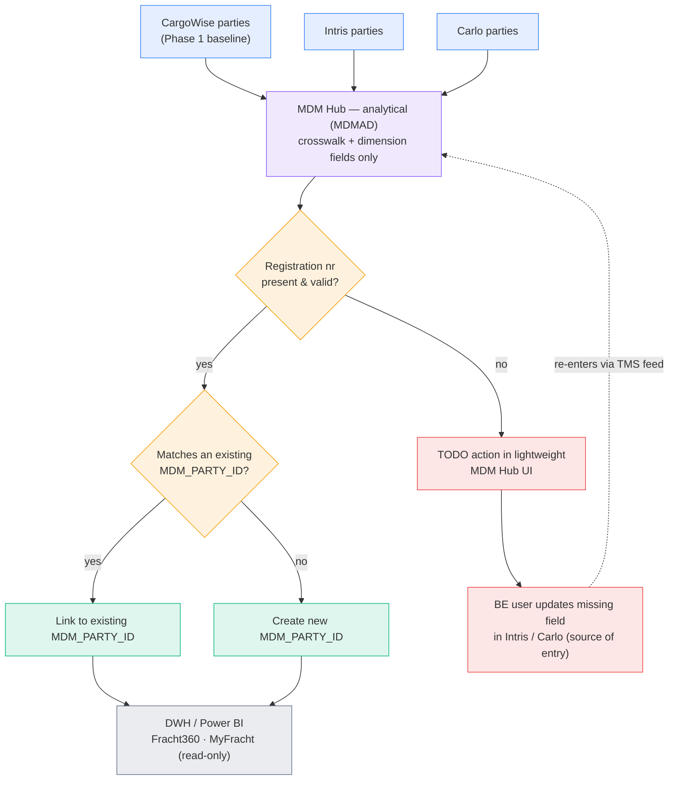
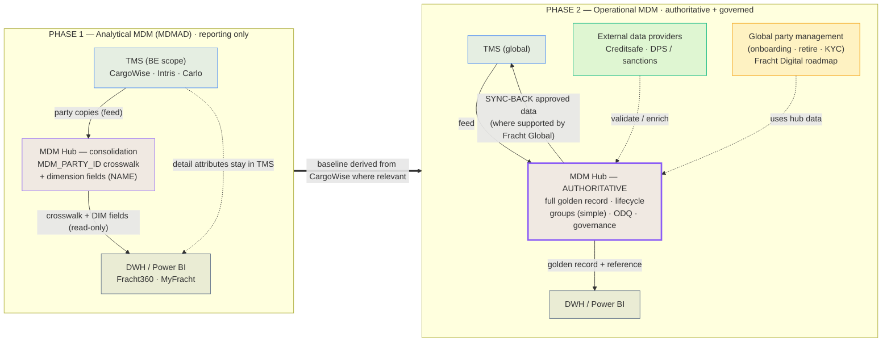
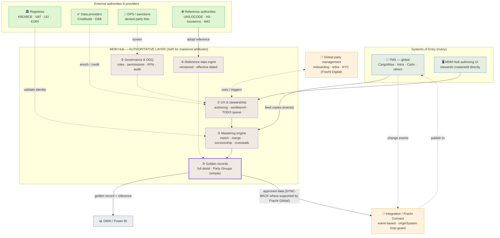
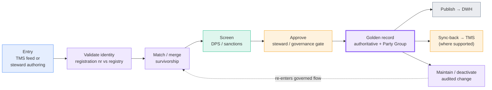

# MDM Deep-Dive — Workshop Preparation

_Prepared: 2026-07-10 · Audience: MDM Core Group, Global IT, Cnext_

**Purpose.** Prepare a shared, unambiguous basis for the MDM workshop. It (1) fixes
the **vocabulary** so every choice we make means the same thing to everyone, (2)
defines the **Phase 1** scope — analytical MDM (MDMAD) that only serves a limited
set of Fracht360 / MyFracht Power BI reports, with **no operational impact on the
TMS**, and (3) frames **Phase 2** — a feature-rich *operational* MDM with global
governance — and the choices we must align on now because they shape everything
later.

> **One sentence to remember:** in Phase 1 the Global Data Warehouse **consumes and
> infers** master data for reporting; it never **authors** it, and it never **writes
> back** to any TMS. Operational MDM (authoring + sync-back) is explicitly a later
> phase.

Sources this document builds on:

- `fitgapanalysis.md` — the master/reference dimensions the 22 reports actually use vs the canonical Logistics Schema.
- `powerbi-dimensions-report.md` — the Fracht360 / AXIS report inventory and dimension usage.
- `260701_Global IT - Internal Meeting_Master Data Management.pptx` — the Global IT MDM charter, draft global/local definitions, governance, roles and next steps.
- `21.06 MDM concept note after MDM workshop .md` — the agreed conceptual model (golden records, SoE/SoR, MDM styles).

---

## 1. Shared vocabulary — align first

We cannot make good scope choices until the words are stable. These definitions are
the **proposed baseline** for the workshop to confirm.

| Term | Agreed meaning for Fracht |
|------|---------------------------|
| **Master data** | The core business *things* Fracht operates on and creates — high volume, always growing. A customer, a supplier, a warehouse, a vessel, a Fracht office. |
| **Reference data** | Externally defined or centrally curated *code lists* used to classify things and transactions — small, stable, often owned by an outside body. Incoterms, HS Codes, Currency, **UN/LOCODE**. |
| **Party (type = Organisation)** | A **legal entity** (supplier or customer) that has a **registered office** and can be identified through the **authoritative identification of the country where it is registered** (e.g. **KBO/BCE number in BE**, VAT, LEI, EORI). This is the anchor for party identity. |
| **`MDM_PARTY_ID`** | The single, group-owned identifier for **one real-world legal entity**. It is the **crosswalk key** that unifies the many TMS copies of *the same* party. It is **not** a group/parent identifier — see Party Group below. |
| **Party Group** | A relationship that links **several distinct parties** to each other and creates a **parent / group level** (e.g. a corporate group). This is a **different** concept from `MDM_PARTY_ID` and is **out of Phase 1** (see §2.2). |
| **Golden record** | The single, de-duplicated "best" version of one real-world thing, assembled from all systems that hold a copy. **Phase 1 does not build a full golden record** — see the Phase 1 note below. A full golden record (all mastered attributes, authoritative) is a **Phase 2** outcome. |
| **Phase 1 "reporting golden record"** | A **minimal** hub record holding only the **crosswalk ID (`MDM_PARTY_ID`)** plus the few fields needed to feed a report **dimension** (e.g. party **NAME**). The **detailed record data stays in the TMS** — Phase 1 does not master attributes. |
| **System of Entry (SoE)** | Where data is first *keyed in* — many exist (a clerk in CargoWise / Intris / Carlo). |
| **System of Record (SoR)** | The **authoritative** source for a given *type* of data — the version everyone trusts. In Phase 1 there is **no** operational SoR change; the TMS remain the SoR for party detail, the hub only holds the crosswalk + dimension fields. |
| **Analytical MDM (MDMAD)** | Master data **consolidated** inside the data platform for internal reporting purposes — crosswalk + minimal dimension fields, read-only. This is all of Phase 1. |
| **Operational MDM** | Governed authoring of master data with **write-back / sync** to the operating systems. Explicitly **Phase 2+**. |

**Three rules to keep repeating in the room:**

1. **One SoR per master-data *type*, but many SoRs overall.** Clients, vessels, GL
   accounts and locations can each have a *different* SoR — and a SoR need not be a
   TMS.
2. **A DWH never *creates* master data — it only *consumes* it.**
3. **MDM is as much organisational change as technology.** Golden records nobody is
   accountable for are golden records nobody trusts.

---

## 2. Phase 1 — Analytical MDM (MDMAD) for reporting only

**Goal.** Deliver **just enough consolidation to build the reporting dimensions** for a
limited set of **Fracht360** and **MyFracht** Power BI reports. Concretely, Phase 1
produces the **crosswalk (`MDM_PARTY_ID`)** and the **minimal fields needed to feed a
dimension** (e.g. party **NAME**) — the **detailed record data stays in the TMS**.
We assume all the data needed to *infer* the consolidation is already available in the
DWH. **No golden record, no operational MDM, no sync-back, no impact on TMS operations.**

> **Narrow by design:** the Phase 1 objective is to be able to **create the reporting
> DIMs** — nothing more. We consolidate parties to one ID and surface dimension fields;
> we do **not** master attributes or assemble a full golden record.

> **📌 Action by Tuesday:** add a **clear list of the master data and reference data
> considered in scope for Phase 1** that we will source into the MDM Hub (see the
> placeholder in §2.6). This turns the scope from principle into an explicit inventory.

### 2.1 Phase 1 scope (Polytra BE)

- **Entity scope:** **Polytra BE** only.
- **Source systems in scope:** **CargoWise, Intris, Carlo (Soloplan)**.
- **Objective:** consolidate the **Parties** entered across CargoWise, Intris and
  Carlo into a **unique `MDM_PARTY_ID`**, based on **validation of the party's
  registration number** (authoritative country identifier, e.g. KBO/BCE + VAT in BE).
- **Hub content (Phase 1):** only the **crosswalk ID** and the **dimension fields**
  (e.g. NAME) required for reporting — not the full record.
- **CargoWise as baseline:** feed the **Phase-1-relevant CargoWise parties** into the
  MDM Hub as the baseline (see C3 — **limit the initial load to parties relevant to
  the BE scope**, not all of CargoWise), then match Intris/Carlo parties against it —
  either **linking to an existing `MDM_PARTY_ID`** or **creating a new** one.

### 2.2 What Phase 1 explicitly does **not** do

Stating the non-goals prevents scope creep in the workshop:

- ❌ **No full golden record** — the hub holds crosswalk + dimension fields only; detail stays in the TMS.
- ❌ **No operational MDM** — the hub does not author the operational record.
- ❌ **No sync-back to any TMS** — nothing is written to CargoWise/Intris/Carlo by MDM.
- ❌ **No Party Groups / company hierarchies** — `MDM_PARTY_ID` unifies copies of *one*
  entity; it is **not** a group/parent ID. **Amazon BE and Amazon NL stay two separate
  parties**, each with its own `MDM_PARTY_ID`. No parent/child, no group rollups.
- ❌ **No global rollout** — Phase 1 is Polytra BE; other entities/countries follow later.
- ✅ **Reporting only** — because Phase 1 is analytics, we deliberately **avoid any
  operational impact in the TMS**.

### 2.3 Reference data vs master data in Phase 1

Phase 1 keeps a clean split:

| Class | Phase 1 treatment |
|-------|-------------------|
| **Reference data** (e.g. **UN/LOCODE**, transport mode, container type, currency, Incoterms) | **Harmonized**, preferably based on **what is already defined in CargoWise**. Curated once, seeded into the DWH as conformed code lists. |
| **Master data** (party/organisation) | **Consolidated incrementally in the MDM Hub, inferred from the transactions** flowing through the in-scope TMS. The hub keeps the **crosswalk + dimension fields**; the `MDM_PARTY_ID` set grows as parties appear in shipments. |

### 2.4 Party consolidation logic and the missing-data loop

Matching is driven by the **registration number** (authoritative country identifier).
When the required identifier is **present**, the hub can match; when it is **missing**
(e.g. no company ID / BE VAT provided in Intris or Carlo), the hub **cannot run the
Phase 1 matching logic** and must ask a human to complete it — **without touching TMS
operations automatically**.

**Reading it:**

1. CargoWise parties seed the baseline; Intris and Carlo parties are matched in.
2. **Registration number present & valid?** If yes → try to match; if it already
   exists, **link** to the existing `MDM_PARTY_ID`, otherwise **create** a new one.
3. **Registration number missing?** → the hub raises a **TODO** in a **lightweight
   MDM Hub user interface**. **BE staff update the missing field in Intris/Carlo**
   (the system of entry). Once corrected, the party re-enters via the normal TMS feed
   and is matched — either linked to an existing (often CargoWise) record or created new.
4. The DWH **consumes** the resulting crosswalk + dimension fields for reporting only;
   detailed party attributes are read from the TMS-sourced data in the DWH, not mastered.

> **Deliberate design point:** the fix happens **in the source TMS**, not by the hub
> writing back. This keeps Phase 1 free of operational sync while still improving data
> quality at source.

### 2.5 Grounding Phase 1 in the reports (fit-gap)

The reports need a small, well-covered set of mastered dimensions — Phase 1 does not
need the full model:

- **Party (Client/Customer/Org)** is used by **21 of 22** reports and is **fully
  covered** by the schema (`organization`, with `taxId` and identifiers). This is the
  one master domain Phase 1 must nail — hence the party-consolidation focus.
- **Reference dimensions** the reports rely on — Date/Time, Container/Equipment,
  Transport Mode, Status — are **reference/derived** and are handled as **conformed
  code lists or semantic-layer constructs**, not MDM master records.
- The two "gaps" (Date/Time, Aging Bucket) are **BI-derived**, not source gaps — built
  in the gold/semantic layer, no MDM effort.
- **Carrier**, **Commodity** and **Claims** are only **partial** masters today; they
  are **not** required for Phase 1 party consolidation and are candidates for Phase 2.

**Implication for the workshop:** Phase 1 MDM effort concentrates on **Party /
Organisation identity**; everything else the reports need is reference/derived and
carries far less governance weight.

### 2.6 Phase 1 in-scope master & reference data — inventory _(to complete by Tuesday)_

> **📌 To be filled in before the workshop.** This inventory turns the Phase 1 scope
> from principle into an explicit list of what we **source into the MDM Hub**. Keep it
> narrow — only what is needed to build the reporting DIMs.

**Master data sourced into the MDM Hub (Phase 1):**

| Master domain | In scope? | Hub content (crosswalk + dimension fields) | Source systems | Notes |
|---------------|:---------:|--------------------------------------------|----------------|-------|
| Party / Organisation (customer, supplier) | ✅ | `MDM_PARTY_ID`, party NAME, registration nr | CargoWise (baseline, BE-relevant), Intris, Carlo | Core Phase 1 objective |
| _…to complete…_ |  |  |  |  |

**Reference data harmonized & seeded (Phase 1):**

| Reference list | In scope? | Preferred source | Notes |
|----------------|:---------:|------------------|-------|
| UN/LOCODE | ✅ | CargoWise | Harmonized, seeded as conformed list |
| Transport mode / Container type / Currency / Incoterms | (confirm) | CargoWise | Only those the in-scope reports actually use |
| _…to complete…_ |  |  |  |

---

## 3. Phase 2 — Operational MDM with global governance

Phase 1 buys trust cheaply. Phase 2 is where the **MDM Hub becomes the authoritative
layer**: it holds the **full details of the golden record**, is initialised with a
**baseline derived from CargoWise where relevant**, and — where **supported by Fracht
Global** — can **sync approved data back to the TMS**. This is the ambition in the
Global IT charter ("single source of truth", "reduce dependency on local TMS",
harmonized definitions, ownership and ODQ globally).

> **When Phase 2 becomes a must:** as soon as **TMS-to-TMS flows (import/export
> nominations)** are required, identity must be authoritative and synchronised —
> analytical MDM is no longer enough, and **operational MDM is mandatory**.

### 3.1 Feature set required for operational MDM

Grouped by the "virtuous circle" the charter uses (Governance → Process → Systems →
Quality → Continuous improvement):

| Capability area | Features to stand up in Phase 2 |
|-----------------|--------------------------------|
| **Authoritative golden record** | The hub holds the **full detail** of each golden record (all mastered attributes), initialised from a **CargoWise-derived baseline where relevant** — it becomes the **SoR** for mastered attributes. |
| **Full lifecycle authoring** | Create, edit, **deactivate/merge/split** master data through a governed UI — the full lifecycle, not just consolidation. |
| **Match / merge / survivorship** | Interactive duplicate detection, merge/unmerge, survivorship rules, confidence scoring, steward review workbench. |
| **Coexistence & sync-back** | Event-based, TMS-agnostic **write-back** of approved records to the TMS **where supported by Fracht Global** (`originSystem` loop-prevention, retry/replay, rollback). |
| **Party Groups & hierarchies** | The relationships **deliberately excluded in Phase 1** (Amazon BE ↔ Amazon NL, corporate groups, ultimate parent). **Keep this simple** — model only what the **business actually needs**; scope to be discussed, not assumed. |
| **Support for onboarding / KYC** *(not owned by MDM)* | Onboarding & KYC are **not a pure MDM Hub function**. The hub **supplies and governs the data** these global processes need; the **process itself** (onboarding, retire, KYC, screening) should be **confirmed/designed as part of the Fracht Digital roadmap** — see §3.2. |
| **Reference data management** | Central authoring + **versioned/effective-dated** publication of code lists (charge codes, GL accounts, currencies, Incoterms, HS, DG, document types), then **sync into TMS**. |
| **Data quality (ODQ) & KPIs** | Global quality criteria (completeness, accuracy, timeliness), KPI dashboards, proactive monitoring and corrective workflows — replacing today's local, reactive controls. |
| **Governance & permissions** | Role-based create/edit/deactivate permissions by data type and by **global vs local** scope; audit trail. |
| **Roles & operating model** | Data Controllers, **Company Data Stewards**, Operations/Accounting/Sales users, Compliance owners — global direction with local execution (federated governance). |

### 3.2 Global party management (onboarding / KYC) — Fracht Digital roadmap

Onboarding and KYC are **enterprise processes the MDM Hub enables, not owns**. The hub
provides the trusted party data, identifiers and audit trail; the end-to-end process
lives in the broader **Fracht Digital** landscape.

- **Suggested action:** **confirm or design a global party-management process**
  (onboarding → maintenance → retire, plus KYC / DPS screening) as part of the Fracht
  Digital roadmap.
- **Data providers:** evaluate **external data providers that validate party data
  during onboarding** — e.g. **Creditsafe** (credit/registration validation), and
  sanctions/denied-party sources — feeding the hub as enrichment/screening inputs.

### 3.3 Global vs local master data — and the **no-hierarchy** principle

The charter draws a first line between **global** (centrally managed) and **local**
(country-specific, maintained locally) master data. We adopt that split — but with one
**explicit design rule** to avoid a common trap:

> **No hierarchy in master data.** We do **not** model global and local master data as
> a parent→child tree. Instead we define **two separate, non-overlapping registers**.
> Overlap is what creates an implicit hierarchy — so we forbid overlap by naming the
> boundary explicitly.

**Worked example — Location:**

| Register | Owns (examples) | Scope | Must **not** contain |
|----------|-----------------|-------|----------------------|
| **Global Location Reference** | Country, **UN/LOCODE**, port/airport, region | Centrally managed, group-wide | Zip codes, streets, delivery points |
| **Local Location / Address Master** | **Zip/postal code, delivery address, road-transport zone, delivery point** | Country-specific, maintained locally | Countries, UN/LOCODEs |

A shipment references **one global location** *and* **one local address** — they sit
**side by side**, not in a parent/child relationship. This keeps each register single-
purpose, avoids "which level owns this attribute?" disputes, and lets local offices
maintain delivery detail without touching the global reference.

> **⚠️ Reconcile with the charter:** slide 8 currently lists **Post Codes** under
> *Global* Locations. Under the no-hierarchy rule, **postal/delivery detail belongs to
> the Local Address Master**. This is a **decision to confirm** in the workshop.

**Draft global vs local split (from the charter, to validate):**

| Domain | Global (centrally managed) | Local (maintained locally) |
|--------|-----------------------------|-----------------------------|
| **Third-party accounts** | Fracht Offices, Shipping Lines, Airlines, Road Transport, External Agents, Customs Brokers, Warehouses, CFS, Terminals, Empty Depots, Shipper, Consignee (identity) | AP/AR accounts, local AR/AP terms & conditions, organisation contacts (except Fracht Offices) |
| **Locations** | Continents, Countries, States, Cities, UN/LOCODE, Trade Lanes, International Zones | **Post codes, delivery addresses, Road Transport Zones** *(per rule above)* |
| **Accounting** | Regional (3-letter) & Company (4-digit) codes, Charge Codes, GL Accounts, Currency, IATA | Exchange rates, tax rules & scenarios, assets management |
| **International trade** | Incoterms, Document Types, Global Services Contracts, HS Codes, DG Listings | — |
| **Compliance** | DPS lists, commodity compliance lists | Required safety documents, certified-staff records (DG, HBL signatures, FF certifications) |
| **Products & services** | Commodity Codes, Global Service levels | Local services list, MAWB stock |
| **Carrier equipment & packages** | Container Types, Vehicle Specifications, Vessels (IMO), Package Types | — |

---

## 4. Choices to align on in the workshop

These are the decisions that most shape the build. Each should get an explicit
"agreed / parked" outcome.

| # | Decision to make | Phase |
|---|------------------|-------|
| C1 | Confirm the **party definition** (legal entity + registered office + authoritative country ID) and that **`MDM_PARTY_ID`** is keyed on the registration number. | 1 |
| C2 | Confirm **Phase 1 = Polytra BE, CargoWise + Intris + Carlo, reporting only, no sync-back**. | 1 |
| C3 | Confirm **CargoWise as the Phase 1 baseline** feed for parties, with the **initial load limited to parties relevant to the BE (Polytra) scope** — not the full CargoWise party base. | 1 |
| C4 | Confirm the **missing-data TODO loop** (fix in Intris/Carlo at source; hub never writes back). | 1 |
| C5 | Confirm **no Party Groups / hierarchies** in Phase 1 (`MDM_PARTY_ID` ≠ group ID; Amazon BE ≠ Amazon NL). | 1 |
| C6 | Confirm **reference data is harmonized from CargoWise**, master data **consolidated (crosswalk + dimension fields) from transactions** — no full golden record in Phase 1. | 1 |
| C6b | Complete the **Phase 1 in-scope master & reference data inventory** (§2.6) **by Tuesday**. | 1 |
| C7 | Adopt the **no-hierarchy rule** for master data and the **Global Location Reference vs Local Address Master** split — including **where Post Codes live**. | 2 |
| C8 | Agree the **operational MDM feature set** (§3.1) — hub as **authoritative golden record**, CargoWise-derived baseline, **sync-back where supported by Fracht Global** — and the trigger (TMS-to-TMS import/export) that makes it mandatory. | 2 |
| C8b | Agree that **Party Groups/hierarchy stay simple** — model only what the business needs (§3.1). | 2 |
| C8c | **Confirm/design a global party-management process** (onboarding, retire, KYC) in the Fracht Digital roadmap and evaluate **data providers** (e.g. Creditsafe) — MDM Hub supports, does not own (§3.2). | 2 |
| C9 | Agree the **federated governance model** and roles (Data Controllers, Company Data Stewards, …). | 2 |
| C10 | Agree **go/no-go readiness gates** before any operational write-back. | 2 |

---

## 5. Conceptual view — Phase 1 vs Phase 2

The single biggest shift between phases is the **direction of trust**: in Phase 1 the
hub is a **read-only consolidation** feeding the DWH; in Phase 2 the hub becomes the
**authoritative source** that also **writes back** to the TMS.

**Reading it:**

- **Phase 1** — TMS feed party copies to the hub; the hub returns only the **crosswalk
  (`MDM_PARTY_ID`) + dimension fields** to the DWH; **detailed attributes stay in the
  TMS**. One-way, read-only, no operational impact.
- **Phase 2** — the hub holds the **full authoritative golden record**, is seeded from a
  **CargoWise-derived baseline**, and **syncs approved data back** to the TMS where
  Fracht Global supports it. **External providers** (Creditsafe, DPS) validate/enrich,
  and the **global party-management process** (Fracht Digital) consumes hub data.

---

## 6. Roadmap at a glance

| Phase | Purpose | Main outcome |
|-------|---------|--------------|
| **Phase 1 — Analytical MDM (MDMAD)** | Consolidate Polytra BE parties to build the reporting DIMs | Unique `MDM_PARTY_ID` crosswalk + dimension fields, BE-scoped CargoWise baseline, harmonized reference data, lightweight TODO UI, Fracht360/MyFracht reports — **no full golden record, no TMS impact** |
| **Phase 2 — Operational MDM** | Govern + author + sync master data globally | Authoritative golden record in hub, full lifecycle, match/merge, sync-back (where supported), simple Party Groups, ODQ KPIs, governance; onboarding/KYC enabled via Fracht Digital + data providers |
| **Later — Selective centralization** | Centrally author where one global definition wins | Locations/reference first; other domains by business decision |

---

## 7. Operational MDM — final target approach (deep dive)

This section zooms in on the **Phase 2 end-state**: the MDM Hub as the **authoritative
layer** for master data, the **functional building blocks** it exposes, and how a
record **flows through the operating model** from entry to governed sync-back.

### 7.1 Target architecture — the authoritative hub in context

**Reading it:** data enters from **many SoE** (TMS feeds + direct steward authoring).
The **mastering engine** resolves identity against **registries** and builds the
**full golden record** (with simple Party Groups). **Reference data** is curated and
versioned centrally. **Governance & ODQ** wraps everything with roles, permissions,
KPIs and audit. Approved data flows **out to the DWH** and — **where Fracht Global
supports it** — **back to the TMS** via event-based integration with loop protection.
**External providers** validate/enrich/screen; the **global party-management process**
(Fracht Digital) drives onboarding/KYC through the same UX.

### 7.2 Functional building blocks supported

| # | Building block | What it does | Key functions |
|---|----------------|--------------|---------------|
| ① | **UX & stewardship** | Human + agent authoring and oversight | Direct create/edit, steward **workbench**, duplicate review, **TODO/exception queue**, approvals |
| ② | **Mastering engine** | Turns many copies into one trusted entity | Deterministic + probabilistic **match**, **merge/unmerge**, **survivorship** rules, **crosswalk** (`MDM_PARTY_ID` ↔ TMS keys), confidence scoring |
| ③ | **Golden records** | The authoritative record | **Full attribute detail**, lifecycle (create → maintain → **deactivate/split**), **simple Party Groups** (only what business needs), history/versioning |
| ④ | **Reference data management** | One governed copy of code lists | Central authoring, **versioned & effective-dated** lists, publish to DWH **and** sync to TMS |
| ⑤ | **Governance & ODQ** | Keeps it trustworthy and compliant | Role/permission model (global vs local scope), **DPS/sanctions** screening hooks, **ODQ KPIs & monitoring**, full **audit trail** |
| ⑥ | **Integration & sync-back** | Safe write-back to operations | Event-based publish/subscribe (**Fracht Connect**), `originSystem` **loop-prevention**, retry/replay, **rollback**, per-field ownership |
| ⑦ | **Enablement for global processes** | Feeds enterprise processes | Supplies governed data to **onboarding/retire/KYC** (owned by Fracht Digital) and to **external validation** (Creditsafe, DPS) |

### 7.3 Record lifecycle — end to end

**The Phase 1 → Phase 2 contrast in one line:** Phase 1 stops at **crosswalk +
dimension fields, read-only**; Phase 2 continues through **screening, approval, full
golden record and governed sync-back**, with every change **audited** and every
write-back gated by **Fracht Global** support and the **go/no-go readiness gates** (C10).

---

_This preparation is deliberately proposal-oriented: it fixes vocabulary, locks the
narrow Phase 1 scope to avoid operational risk, and surfaces the Phase 2 choices early
so the workshop can decide rather than discover._