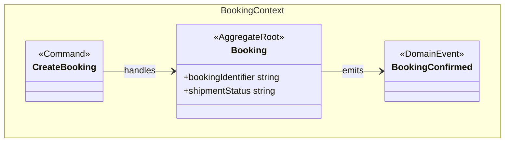

chall# DDD and Data Architecture Governance Extensions

This document proposes a design for adding DDD design and data architecture
governance capabilities around the ontology hub without overloading the core
domain ontology.

## 1. Design Position

DDD and data architecture metadata should be modeled as **optional ontology
extensions**, not as mandatory concepts inside every domain ontology.

The core ontology should remain focused on durable business meaning:

- business classes;
- business relationships;
- business attributes;
- labels and definitions;
- cross-domain semantics.

DDD and data architecture concerns should be added as separate extension layers
that annotate, classify, or relate to the core ontology.

```text
Core domain ontology
        ↓
DDD governance extension
        ↓
Data architecture governance extension
        ↓
Technical projections: UML, dbt, Power BI, catalog, lineage, quality reports
```

This keeps the domain model lean while still enabling richer architecture,
governance, and design projections.

## 2. Why Not Put Everything in the Core Ontology?

Full DDD and full data architecture modeling can become too complex if placed
directly in the domain ontology.

| Risk | Explanation |
|------|-------------|
| Model bloat | Business classes become mixed with delivery, ownership, platform, and behavior metadata. |
| Reduced business readability | Stakeholders reviewing `Booking` or `TradeParty` should not need to understand all architecture annotations. |
| Projection coupling | Data-platform concerns such as table type, SLA, or retention policy should not define business meaning. |
| Over-modeling behavior | Commands, policies, and workflows often need process/application design, not only semantic classification. |
| Governance friction | If every class requires many DDD/data-architecture annotations, modeling slows down and adoption suffers. |

The recommended approach is therefore **layered governance**: add only the
annotations needed to produce valuable outputs.

## 3. Proposed Extension Layers

### 3.1 Core Domain Ontology

The core ontology remains the source of truth for business semantics.

Example concepts:

- `Booking`
- `TradeParty`
- `Invoice`
- `CargoItem`
- `TransportLeg`
- `EmissionReport`

Example properties:

- `hasContact`
- `hasPackage`
- `bookingIdentifier`
- `partyName`
- `invoiceAmount`

The core ontology should not need to know whether a class is a dbt dimension, a
Power BI table, an aggregate root, or a governed data product.

### 3.2 DDD Governance Extension

The DDD extension captures **design intent** around the ontology.

It should answer questions such as:

- Which class is an aggregate root?
- Which classes are entities or value objects?
- Which domain events are important?
- Which commands operate on which aggregate?
- Which invariants must be protected?
- Which bounded context owns a concept?
- Which concepts are shared kernel versus context-local?

Recommended namespace:

```turtle
@prefix kairos-ddd: <https://kairosflow.ai/ontology/ddd#> .
```

Recommended annotation properties:

| Annotation | Applies to | Purpose |
|------------|------------|---------|
| `kairos-ddd:boundedContext` | class, property, ontology | Assigns a model element to a bounded context. |
| `kairos-ddd:tacticalPattern` | class | Classifies as `AggregateRoot`, `Entity`, `ValueObject`, `DomainEvent`, `DomainService`, etc. |
| `kairos-ddd:aggregateRoot` | class | Links an aggregate member to its aggregate root. |
| `kairos-ddd:aggregateBoundary` | class | Marks a class as defining a consistency boundary. |
| `kairos-ddd:ownedByContext` | class, property | Identifies semantic ownership. |
| `kairos-ddd:publishedLanguage` | ontology, class | Marks concepts exposed to other contexts. |
| `kairos-ddd:contextRelationship` | ontology, class | Captures upstream/downstream, conformist, anticorruption, shared-kernel relationships. |
| `kairos-ddd:supportsCommand` | class | Links an aggregate or entity to a command design artifact. |
| `kairos-ddd:emitsEvent` | class | Links an aggregate or process to a domain event. |
| `kairos-ddd:protectsInvariant` | class | Links an aggregate to an invariant description. |

Recommended controlled values:

```text
AggregateRoot
AggregateMember
Entity
ValueObject
DomainEvent
DomainService
Policy
Specification
Repository
Factory
```

Context relationship values:

```text
SharedKernel
CustomerSupplier
Conformist
AnticorruptionLayer
OpenHostService
PublishedLanguage
SeparateWays
```

### 3.3 Data Architecture Governance Extension

The data architecture extension captures **platform, ownership, governance, and
data-product intent** around ontology concepts.

It should answer questions such as:

- Which ontology classes become governed data products?
- Who owns a data product or domain?
- Which classes contain sensitive or regulated data?
- Which quality rules apply?
- Which data products have freshness or availability expectations?
- Which concepts are exposed to BI, search, graph, or APIs?
- Which source systems feed a concept?

Recommended namespace:

```turtle
@prefix kairos-data: <https://kairosflow.ai/ontology/data-architecture#> .
```

Recommended annotation properties:

| Annotation | Applies to | Purpose |
|------------|------------|---------|
| `kairos-data:dataProduct` | class, ontology | Groups ontology concepts into a data product. |
| `kairos-data:dataProductOwner` | data product, ontology | Identifies accountable ownership. |
| `kairos-data:steward` | class, property, data product | Identifies data stewardship responsibility. |
| `kairos-data:servingLayer` | class | Classifies intended serving layer: silver, gold, semantic, search, graph, API. |
| `kairos-data:criticality` | class, data product | Classifies business criticality. |
| `kairos-data:confidentiality` | class, property | Classifies data sensitivity. |
| `kairos-data:retentionPolicy` | class, data product | Links to retention expectations. |
| `kairos-data:freshnessSla` | class, data product | Defines freshness expectations. |
| `kairos-data:qualityRule` | class, property | Links to data quality constraints or tests. |
| `kairos-data:lineageSource` | class, property | Links to source systems or mappings. |
| `kairos-data:consumer` | data product | Captures known consumers or channels. |
| `kairos-data:certificationStatus` | data product | Marks whether the product is draft, governed, certified, or deprecated. |

Recommended controlled values:

Serving layer:

```text
Bronze
Silver
Gold
Semantic
Search
Graph
API
Operational
```

Criticality:

```text
Low
Medium
High
MissionCritical
```

Confidentiality:

```text
Public
Internal
Confidential
Restricted
PersonalData
SensitivePersonalData
```

Certification status:

```text
Draft
InReview
Certified
Deprecated
```

## 4. Example Extension Pattern

The extension should live outside the core domain ontology, for example:

```text
ontology-hub/
  model/
    ontologies/
      booking/booking.ttl
      party/party.ttl
    extensions/
      booking-ddd-ext.ttl
      booking-data-arch-ext.ttl
      party-ddd-ext.ttl
      party-data-arch-ext.ttl
```

Example DDD extension:

```turtle
@prefix booking: <https://frachtdigital.com/ont/booking#> .
@prefix kairos-ddd: <https://kairosflow.ai/ontology/ddd#> .

booking:Booking
    kairos-ddd:boundedContext "Booking" ;
    kairos-ddd:tacticalPattern "AggregateRoot" ;
    kairos-ddd:aggregateBoundary true ;
    kairos-ddd:supportsCommand "CreateBooking" ;
    kairos-ddd:supportsCommand "CancelBooking" ;
    kairos-ddd:emitsEvent "BookingConfirmed" ;
    kairos-ddd:protectsInvariant "A booking cannot be confirmed without a shipper, consignee, transport mode, and cargo-ready date." .
```

Example data architecture extension:

```turtle
@prefix booking: <https://frachtdigital.com/ont/booking#> .
@prefix kairos-data: <https://kairosflow.ai/ontology/data-architecture#> .

booking:Booking
    kairos-data:dataProduct "Transport Order Data Product" ;
    kairos-data:dataProductOwner "Logistics Operations" ;
    kairos-data:servingLayer "Silver" ;
    kairos-data:servingLayer "Gold" ;
    kairos-data:criticality "High" ;
    kairos-data:confidentiality "Internal" ;
    kairos-data:freshnessSla "PT1H" ;
    kairos-data:certificationStatus "InReview" .
```

## 5. Projection Capabilities

### 5.1 UML / DDD Projection

The DDD extension can enhance UML class diagrams.

| Extension metadata | UML output |
|--------------------|------------|
| `tacticalPattern = AggregateRoot` | `<<AggregateRoot>>` stereotype |
| `tacticalPattern = ValueObject` | `<<ValueObject>>` stereotype |
| `boundedContext` | UML package or namespace |
| `aggregateRoot` | Composition grouping or aggregate diagram |
| `supportsCommand` | Command box linked to aggregate |
| `emitsEvent` | Event class linked from aggregate |
| `protectsInvariant` | Note attached to aggregate |

Example diagram intent:



### 5.2 Data Product Catalog Projection

The data architecture extension can generate a catalog view.

| Metadata | Catalog output |
|----------|----------------|
| `dataProduct` | Data product page |
| `dataProductOwner` | Owner/accountability field |
| `steward` | Stewardship field |
| `servingLayer` | Available platform outputs |
| `freshnessSla` | SLA section |
| `qualityRule` | Quality checks |
| `lineageSource` | Source-system lineage |
| `certificationStatus` | Governance badge |

### 5.3 dbt and Medallion Projection

Data architecture annotations can inform dbt and medallion-layer outputs.

Possible generated outputs:

- model tags;
- dbt exposures;
- dbt groups;
- model owners;
- freshness tests;
- quality tests;
- documentation blocks;
- data-product metadata YAML.

### 5.4 Power BI / Semantic Projection

Data architecture annotations can also enrich Power BI semantic models.

Possible generated outputs:

- table descriptions;
- certified/promoted status;
- sensitivity labels;
- owner metadata;
- domain grouping;
- consumer-facing documentation.

### 5.5 XMI / Enterprise Architect Projection

An XMI projection can seed Enterprise Architect or another UML/DDD tool with the
ontology structure.

Recommended scope:

| Ontology construct | XMI / UML projection |
|--------------------|----------------------|
| `owl:Class` | `uml:Class` |
| Ontology domain or bounded context | `uml:Package` |
| `owl:DatatypeProperty` | UML owned attribute |
| `owl:ObjectProperty` | `uml:Association` |
| `rdfs:subClassOf` | `uml:Generalization` |
| `rdfs:comment` | UML comment or documentation field |
| Ontology IRI | Stable trace key in comment and `xmi:Extension` |
| DDD stereotype | UML stereotype or tagged value |

The XMI projection should carry the ontology IRI on every generated element.
This IRI is the stable synchronization key; EA GUIDs and diagram-local IDs should
not be treated as semantic identifiers.

Recommended XMI metadata:

```xml
<ownedComment xmi:type="uml:Comment">
  <body>ontologyIRI=https://frachtdigital.com/ont/booking#Booking</body>
</ownedComment>
<xmi:Extension extender="Kairos Ontology Toolkit">
  <ontologyIRI>https://frachtdigital.com/ont/booking#Booking</ontologyIRI>
  <ontologyRole>owlClass</ontologyRole>
  <projectionVersion>1.0</projectionVersion>
  <modelHash>...</modelHash>
</xmi:Extension>
```

Enterprise Architect should import this projection into a dedicated package such
as `Ontology Projection`. DDD designers can then create state diagrams, sequence
diagrams, command workflows, and decision notes that reference the imported
classes.

### 5.6 Round-Trip Sync Position

The recommended default is **controlled round-trip**, not automatic
bi-directional overwrite.

Ownership should be explicit:

| Artifact | Source of truth |
|----------|-----------------|
| Business classes, properties, and semantic relationships | Ontology TTL |
| DDD stereotypes and aggregate metadata | DDD extension TTL |
| Data-product ownership and governance metadata | Data architecture extension TTL |
| Generated UML class structure | XMI projection output |
| State diagrams, sequence diagrams, workflows, and layouts | Enterprise Architect |
| Structural change proposals from EA | Pull request back to ontology or extension TTL |

Recommended sync flow:

```text
Ontology TTL + extensions
        ↓ generate XMI
Enterprise Architect import
        ↓ designers add behavior diagrams
EA export XMI
        ↓ IRI-based comparison
Change proposals back to ontology / extensions
```

The comparison should use ontology IRIs rather than names or EA IDs.

| Diff case | Recommended action |
|-----------|--------------------|
| IRI exists in ontology but not EA | Add/import generated element. |
| IRI exists in both, metadata changed in ontology | Update EA generated metadata. |
| IRI exists in EA but not ontology | Mark deprecated or classify as EA-owned design artifact. Do not delete automatically. |
| EA element has no ontology IRI | Treat as behavioral/design artifact or structural change proposal. |
| EA proposes new structural class/property | Convert into ontology PR after domain review. |

### 5.7 Version Management

Version management must separate semantic model versioning from projection and
tooling versioning.

| Version field | Location | Purpose |
|---------------|----------|---------|
| `owl:versionInfo` | ontology TTL | Semantic version of the domain ontology. |
| `dcterms:modified` | ontology or extension TTL | Last semantic modification date. |
| `kairos-ddd:designVersion` | DDD extension | Version of DDD design annotations. |
| `kairos-data:governanceVersion` | data architecture extension | Version of governance metadata. |
| `projectionVersion` | XMI extension metadata | Version of the XMI projection contract. |
| `generatorVersion` | XMI extension metadata | Version of the tool that generated the XMI. |
| `modelHash` | XMI extension metadata | Hash of the source ontology element used to detect drift. |
| EA baseline/version | Enterprise Architect | Version of EA-owned diagrams and behavioral design. |

Recommended storage pattern:

```text
ontology-hub/
  model/
    ontologies/
    extensions/
  output/
    uml/
      ontology-uml.xmi
      ontology-uml.mmd
      projection-manifest.json
  architecture/
    ea/
      exports/
        ea-behavior-export-YYYY-MM-DD.xmi
        ea-sync-report-YYYY-MM-DD.md
```

Generated XMI should be treated as reproducible output. EA-owned exports and
sync reports can be versioned as architecture artifacts when they capture
behavioral design decisions or reviewed change proposals.

Recommended governance rules:

| Rule | Severity |
|------|----------|
| Every generated XMI class/property/association must include `ontologyIRI`. | Error |
| Generated XMI must include projection and generator version metadata. | Error |
| EA-originated structural changes must be reviewed before changing ontology TTL. | Error |
| EA-owned behavior diagrams should reference ontology IRIs where possible. | Warning |
| Generated XMI imports must not overwrite EA-owned diagrams or layout without explicit approval. | Error |
| Deprecated ontology IRIs should remain traceable for at least one release cycle. | Warning |

## 6. Validation Rules

Governance extensions should be validated with SHACL or equivalent checks.

Recommended rules:

| Rule | Severity |
|------|----------|
| Every `AggregateRoot` must have a `boundedContext`. | Error |
| Every `AggregateMember` must link to an `aggregateRoot`. | Error |
| Every `supportsCommand` should reference a documented command. | Warning |
| Every `protectsInvariant` should have a human-readable statement. | Warning |
| Every `dataProduct` must have an owner. | Error |
| Every certified data product must have freshness and quality metadata. | Error |
| Restricted or personal data must have a confidentiality classification. | Error |
| Deprecated data products should identify a replacement or sunset note. | Warning |
| Every XMI-projected semantic element must carry a stable ontology IRI. | Error |

## 7. What Should Not Be Modeled in the Ontology

Some DDD and data architecture details should remain outside the ontology or be
linked as external design artifacts.

| Concern | Recommended treatment |
|---------|-----------------------|
| Detailed workflow orchestration | Link to BPMN, process docs, or application design. |
| Full command handler implementation | Keep in application code; reference the command name or artifact. |
| Complex policy logic | Link to rules/code, or model only the policy concept. |
| UI screen behavior | Keep in UX/application documentation. |
| Physical infrastructure topology | Link to architecture diagrams or IaC repositories. |
| Runtime operational metrics | Keep in observability systems; reference SLA/SLO targets only. |
| Enterprise Architect diagram layout | Keep in EA; do not round-trip into the ontology. |
| Tool-specific EA GUIDs | Keep as tool metadata; use ontology IRIs for semantic sync. |

## 8. Recommended Adoption Path

Start small and add governance where it creates projection value.

1. Add DDD annotations for bounded context, aggregate root, entity, value object,
   domain event, and command.
2. Enhance UML projection to show DDD stereotypes and command/event links.
3. Add data-product annotations for owner, steward, serving layer, criticality,
   confidentiality, freshness, and certification status.
4. Generate a simple data-product catalog markdown report.
5. Add SHACL validation for mandatory governance fields.
6. Add XMI projection with ontology IRI traceability for UML/DDD tools.
7. Define a controlled EA sync process using IRI-based diff reports.
8. Expand projection into dbt, Power BI, and architecture reports only where the
   metadata is actively consumed.

## 9. Recommendation

This capability fits the ontology hub well if it is implemented as **two
separate extension vocabularies**:

- `kairos-ddd` for DDD design intent;
- `kairos-data` for data architecture governance.

It would be too complex if forced into the core ontology or made mandatory for
every class. The value comes from keeping the business model lean while enabling
optional, validated, projection-ready governance metadata.
