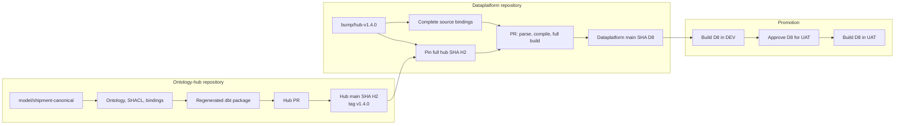
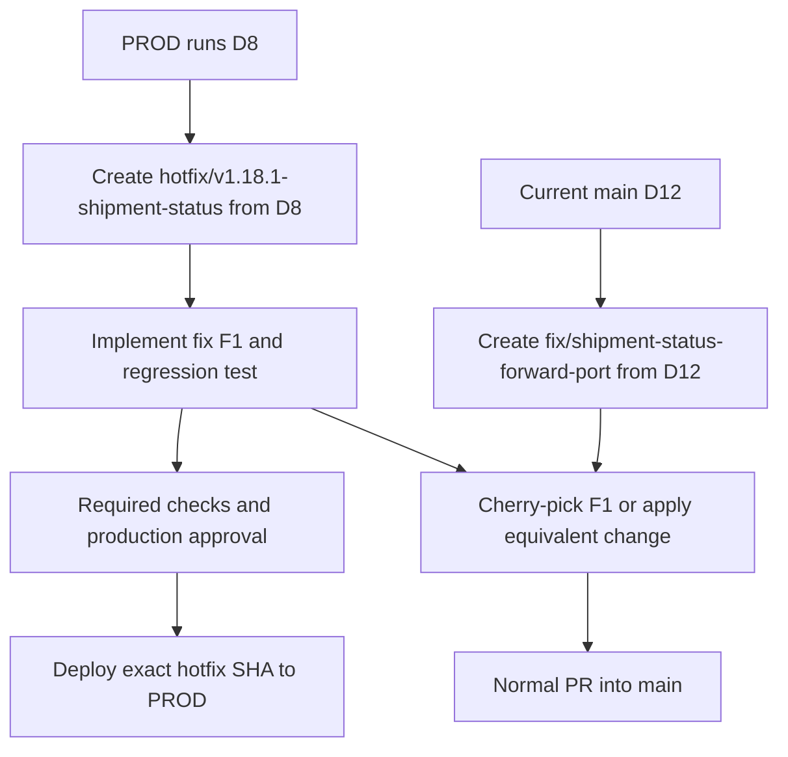
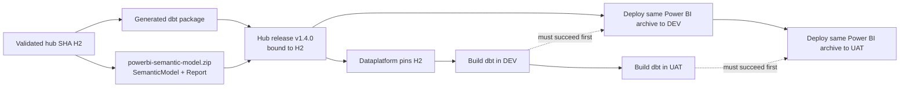

# Branching and Collaboration Guide for Hub and Dataplatform Repositories (DD-206)

**Status:** Accepted design; scaffold implementation required
**Date:** 2026-08-27
**Audience:** ontology-hub modelers, dataplatform engineers, reviewers, and release operators
**Related:** issue [#590](https://github.com/Cnext-eu/kairos-ontology-toolkit/issues/590);
DD-020; DD-067; `docs/design/ontology-dbt-dataplatform-design-architecture.md`

---

## 1. Decision

Use a simple trunk-based workflow in both repositories:

- protected `main` is the only long-lived branch;
- all normal changes use short-lived branches and pull requests;
- Git branches do not represent DEV, UAT, or PROD;
- dbt targets and protected environment configuration select the environment;
- the hub publishes reviewed generated output from an exact Git commit;
- the dataplatform pins the hub with a full 40-character commit SHA;
- the exact dataplatform commit is deployed to DEV, then UAT, then PROD;
- lockfiles make the commit reproducible;
- rollback redeploys a previously successful dataplatform commit; and
- a PROD hotfix is created from the commit running in PROD and then forward-ported to `main`.

GitHub pull requests, checks, Environments, approvals, tags, workflow runs, and deployment history
provide the initial audit trail. No custom release ledger or release-identity service is required.

### Core invariants

1. A branch never selects a data environment.
2. Production never consumes a moving branch or a tag as its dependency identity.
3. Authored hub inputs and generated output are reviewed together.
4. DEV, UAT, and PROD build the same dataplatform commit against their own sources.
5. Missing physical source bindings fail before warehouse execution.
6. A production fix is also applied to current `main`.

## 2. Repository and publication topology

### Ontology-hub repository

One Git repository contains:

```text
ontology-hub/                  # authored inputs
ontology-hub-publish/          # generated, compiler-owned output
CICD.md                        # generated operating guide
```

Release-relevant output under `ontology-hub-publish/` is Git-tracked. It is generated by the
toolkit and never hand-edited. A pull request that changes ontology, shapes, bindings, or
contracted dbt inputs also contains the generated diff.

Sensitive reports, credentials, raw samples, caches, and environment-specific observations remain
ignored. The scaffold defines an explicit allowlist of generated files that may be committed.

### Dataplatform repository

The dataplatform is a separate repository:

```text
models/downstream_only/        # dataplatform-owned models
packages.yml                   # immutable hub package pin
package-lock.yml               # resolved dbt dependencies, when supported
CICD.md                        # generated operating guide
```

The hub package is pinned by full commit SHA:

```yaml
packages:
  - git: "https://github.example.com/acme/customer-ontology-hub.git"
    revision: "0123456789abcdef0123456789abcdef01234567"
    subdirectory: ontology-hub-publish/medallion/dbt
```

A hub release tag is a readable label used to discover the release. The SHA is the dependency
identity used by dbt.

Both repositories commit dependency locks. The hub uses `uv.lock` and `uv sync --locked`. The
dataplatform pins dbt Core and its adapter and commits the applicable Python and dbt package locks.

## 3. Branches and collaboration

### Hub branches

| Prefix | Purpose |
|---|---|
| `model/<domain>-<topic>` | Ontology, shape, binding, or contracted dbt change |
| `import/<source>-<topic>` | New or corrected source evidence |
| `upgrade/toolkit-<version>` | Toolkit/reference-model upgrade |
| `fix/<topic>` | Normal correction |
| `hotfix/<version>-<topic>` | Urgent correction based on a released hub commit |

### Dataplatform branches

| Prefix | Purpose |
|---|---|
| `feature/<topic>` | Downstream model or orchestration change |
| `bump/hub-<version>` | Hub SHA and physical binding update |
| `fix/<topic>` | Normal correction |
| `hotfix/<version>-<topic>` | Urgent correction based on the commit running in PROD |
| `chore/<topic>` | Dependency, workflow, or maintenance change |

Branches should live for days, not weeks. Open a draft PR early when changing a shared domain.
Concurrent edits to the same domain are allowed only when the domain owner coordinates their
integration order.

CI must validate the prospective merge result. A merge queue is preferred. Without one, update the
branch from current `main`, regenerate output, and rerun checks before merging.

Toolkit/reference-model upgrades remain isolated from modeling changes so reviewers can distinguish
tool-generated consequences from intentional semantic changes.

## 4. Minimum CI/CD workflow

### Hub pull request

The hub PR:

1. restores dependencies with `uv sync --locked`;
2. validates ontology syntax, SHACL, bindings, and contracted dbt inputs;
3. runs compile checks;
4. regenerates the tracked publish output;
5. fails if the committed output differs from regenerated output; and
6. validates the assembled dbt package.

After merge, a release tag may label the `main` commit. The release workflow validates the tracked
bytes at that commit; it does not generate different bytes after tagging.

### Dataplatform pull request

The dataplatform PR:

1. restores pinned dbt Core and adapter dependencies;
2. runs `dbt deps`;
3. verifies the hub package resolves to the expected full SHA;
4. verifies every logical source used by the package has a physical binding;
5. runs `dbt parse` and `dbt compile`; and
6. runs a full isolated `dbt build --target ci`.

The full build is the default because it is easier to understand and safer to operate than Slim
CI state management. It runs applicable unit tests, materializes models, and then runs data tests
in dependency order.

dbt unit tests cover models in the current dataplatform project. Runtime tests over imported hub
models execute as part of the dataplatform build.

### Environment promotion

After the PR merges:

```text
dataplatform commit D8
    -> dbt build --target dev
    -> approval
    -> dbt build --target uat
    -> approval
    -> dbt build --target prod
```

Each job checks out `D8`. It never checks out whichever commit happens to be current `main`.
Environment credentials and physical source locations differ, but dbt code, the hub SHA, and
dependency locks remain the same.

Use GitHub Environments for credentials and approvals. Retain the workflow run, `manifest.json`,
and `run_results.json` for each deployment.

### Rollback

Rollback redeploys the last known-good dataplatform SHA recorded by GitHub deployment history.
It does not revert `main` or move a tag.

Warehouse data changes may prevent a simple code rollback. A release with destructive or
non-backward-compatible data behavior needs an explicit recovery or forward-fix plan.

## 5. Physical source binding

The dataplatform owns real database, schema, and table identifiers. The hub owns the logical source
names used by generated models.

The scaffold must provide a validation step that compares package source usage with dataplatform
bindings and fails on missing, unknown, duplicate, or stale entries. A package placeholder must
never be accepted as a deployable binding.

dbt's `overrides:` source property may be used temporarily, but it is deprecated and silently
retains package defaults when an entry is omitted. It is not the long-term validation contract.

A `bump/hub-*` PR updates the hub SHA, dependency lock, and required source bindings together.

## 6. Scenario: add an ontology domain and promote it to DEV and UAT

Assume the team adds a `shipment` domain and DEV/UAT already contain the required Bronze tables.



The hub tag helps the engineer find `H2`; `packages.yml` pins `H2`. Both DEV and UAT check out
`D8`. They rebuild Silver/Gold models against their own Bronze sources; they do not copy tables
between environments.

| Concern | DEV to UAT |
|---|---|
| Hub package | Same hub SHA `H2` |
| Dataplatform code | Same dataplatform SHA `D8` |
| dbt target, credentials, and source data | Environment-specific |
| Silver/Gold relations | Rebuilt in each environment |

## 7. Scenario: fix a bug in PROD and forward-port it

Assume PROD runs dataplatform commit `D8`, while `main` has advanced to `D12`.



The fix is authored once and integrated twice:

1. create the hotfix branch from the exact SHA running in PROD;
2. add the smallest fix and a regression test;
3. run required checks and deploy the exact hotfix SHA after approval;
4. create a normal branch from current `main`;
5. cherry-pick the hotfix commit, or reapply the same behavior if current code has diverged; and
6. merge the forward-port through a normal PR.

The PROD-based branch is never merged wholesale into `main`, because that could reintroduce old
release content. If policy requires every production change to use a PR, create a temporary
hotfix base at `D8`; this is an optional policy accommodation, not the default workflow.

If the defect originates in a hub-generated model, make and release the hub hotfix from the hub SHA
used by PROD, adopt its new SHA in a dataplatform hotfix, and forward-port both repository changes.

## 8. Power BI report and semantic-model release lane

When a Gold Power BI profile is configured, the hub projects two deployable products from the same
CompilePlan:

- the generated semantic model; and
- the first generated report version bound to that model.

They ship together as `powerbi-semantic-model.zip` on the same hub release as the dbt package.
The archive is a separate deployment artifact, not a dbt package directory.



### Hub release responsibility

The hub release workflow must:

1. run Gold emission for every configured domain;
2. perform all required wrapper generation and TMDL normalization in the hub;
3. validate PBIP structure, report JSON, TMDL, DAX, relationships, and generated security metadata;
4. package all required `*.SemanticModel` and `*.Report` folders together;
5. publish `powerbi-semantic-model.zip` beside the dbt release artifact;
6. record the hub commit SHA and archive SHA-256 in release evidence; and
7. fail when Gold is configured but the expected report or semantic model is absent.

The generated report is a deployable starting version, not proof of business acceptance. Changes
to compiler-owned report/model output must be modeled in the hub and regenerated. Any
dataplatform-owned report extension must live outside compiler-owned output and declare its
ownership explicitly.

### Dataplatform infrastructure responsibility

The dataplatform Power BI workflow must:

1. accept hub release tag, expected hub SHA, expected archive SHA-256, and target environment;
2. verify that the tag resolves to the expected hub SHA;
3. download the archive and verify its SHA-256 before extraction;
4. validate both the semantic model and report without rewriting archive contents;
5. use GitHub Environment credentials and approvals for the target Fabric workspace;
6. deploy both `SemanticModel` and `Report` item types;
7. deploy only after the target environment's dbt build succeeds; and
8. retain deployment evidence in the workflow run.

DEV, UAT, and PROD receive the same archive. Only approved environment parameterization changes:
workspace IDs, lakehouse/warehouse connections, and other declared deployment settings. The
workflow must not regenerate or hand-edit TMDL, PBIR, or report JSON.

The current dataplatform packaging helper mutates extracted semantic-model files. DD-206 requires
that normalization to move into hub emission/release before validation and checksumming. The
dataplatform replacement is read-only validation followed by deployment.

Power BI rollback redeploys the archive from the previous successful hub release. It does not
rebuild a new archive from current `main`.

## 9. Generated `CICD.md` requirements

The toolkit must scaffold a separate managed `CICD.md` at the root of both repository types.
`CONTRIBUTING.md` explains how to contribute; `CICD.md` explains how changes are validated,
released, promoted, rolled back, and hotfixed.

### Hub `CICD.md`

The hub guide must document:

- branch names and the PR-only rule for normal work;
- required hub PR checks and generated-output freshness;
- the tracked versus ignored parts of `ontology-hub-publish/`;
- release tagging and full-SHA package identity;
- toolkit/reference-model upgrade isolation;
- hub rollback and hotfix/forward-port steps;
- Power BI report/semantic-model packaging, validation, checksums, and release evidence; and
- links to the exact generated workflows and operator commands.

### Dataplatform `CICD.md`

The dataplatform guide must document:

- immutable hub SHA adoption through `bump/hub-*`;
- physical source-binding validation;
- the full PR build and `ci` target;
- exact-SHA DEV/UAT/PROD promotion with GitHub Environments;
- artifact retention and where to find deployment history;
- rollback and PROD hotfix/forward-port steps;
- exact Power BI archive verification and deployment of both report and semantic model;
- ordering Power BI deployment after the target environment's dbt build; and
- links to the exact generated workflows and operator commands.

Both files are toolkit-managed, carry an auto-generated header, participate in managed-file drift
checks, and have scaffold tests proving that commands, paths, and workflow names are accurate.

## 10. Skill review requirements

Implementation must review the following skills. Workflow rules should be linked to `CICD.md`
rather than copied into every design skill.

- **`kairos-setup-init`:** confirm hub `CICD.md` is scaffolded and point new users to it.
- **`kairos-setup-dataplatform`:** confirm dataplatform `CICD.md`, the CI target, and workflows
  exist, including infrastructure inputs for report and semantic-model deployment.
- **`kairos-design-gold`:** state that Gold produces the first report and semantic-model version,
  while target-workspace deployment and business acceptance remain downstream.
- **`kairos-execute-project`:** state that emitted release output belongs in the hub PR.
- **`kairos-package-dataplatform`:** require full-SHA pins, binding checks, and exact-SHA
  promotion, plus verified consumption of the Power BI archive.
- **`kairos-toolkit-ops`:** add hub release, Power BI archive/checksum, hotfix, forward-port, and
  managed-guide rules.
- **`SC-merge-pr`:** review for conflicts, but keep toolkit-repository release rules separate.
- **`kairos-toolkit-dev`:** require paired skill/scaffold updates and tests for DD-206.
- **`kairos-help`:** link users to the appropriate setup, package, and operations skills.

The ontology, mapping, discovery, and MDM design skills do not need CI/CD choreography. The Gold
skill needs only the producer/consumer boundary above, not deployment logic. All design skills
preserve the existing rule that authored changes occur on a feature branch and compiler-owned
output is not hand-edited.

Every changed managed skill must remain byte-identical to its copy under
`src/kairos_ontology/scaffold/skills/`.

## 11. Upgrading existing client repositories

Do not recreate an existing hub or dataplatform with `new-repo` or `init-dataplatform`. Adopt this
setup in a dedicated upgrade PR. Managed documentation can be installed automatically; repository
policy and environment configuration require review.

### Before either upgrade

1. Start with a clean working tree and create an `upgrade/toolkit-<version>` or
   `chore/adopt-dd206` branch.
2. If the repository already has a root `CICD.md`, copy it to a temporary location outside the
   repository and compare it with the generated guide afterward. Once `CICD.md` becomes a managed
   path, `kairos-ontology update` replaces an unmanaged file at that path.
3. Record current branch protection, required checks, environments, deployment workflows, and the
   commit currently deployed to PROD.
4. Never put credentials, profile secrets, or copied production data in the migration PR.

### Existing ontology hub

From the repository root:

```powershell
git switch -c upgrade/toolkit-<version>
uv run kairos-ontology update --upgrade
# On Windows, wait for the detached managed-file refresh to finish.
uv run kairos-ontology update --check
```

`update --upgrade` advances the toolkit pin, updates the lock, upgrades pinned reference models,
and refreshes managed files under the installed toolkit version. On Windows, the managed refresh
continues in a detached process after `update --upgrade` exits. Wait for it to finish and confirm
`.kairos/upgrade-refresh.log` reports success before running `update --check`.

If the repository already uses the required toolkit version but is missing managed files, run:

```powershell
uv sync --locked
uv run kairos-ontology update
uv run kairos-ontology update --check
```

The upgrade automatically adds or refreshes the managed hub `CICD.md`. Review that file and every
managed skill/instruction diff.

The hub owner must then review these repository-specific changes; they are not inferred by
`update`:

- protect `main` and require PR checks;
- decide which safe release files under `ontology-hub-publish/` are Git-tracked;
- retain ignore rules for samples, credentials, caches, and sensitive reports;
- make PR CI regenerate release output and fail on drift;
- make the release workflow validate reviewed output at the tagged commit;
- emit and validate the first Power BI report and semantic model when Gold is configured;
- publish `powerbi-semantic-model.zip` with its archive SHA-256;
- configure immutable release-tag protection; and
- document any local release or approval rules in a separate, non-managed supplement linked from
  `CICD.md`.

Run the normal validation for every affected domain, regenerate release output, and review the
complete diff before merging the upgrade PR. Do not combine this migration with ontology or
binding changes.

### Existing dataplatform

From the dataplatform root containing `dbt_project.yml`:

```powershell
git switch -c chore/adopt-dd206
uv run kairos-ontology update --upgrade
# On Windows, wait for the detached managed-file refresh to finish.
uv run kairos-ontology update --check
```

The command detects `dbt_project.yml` and selects the dataplatform managed-file set. It adds or
refreshes the dataplatform `CICD.md` and the dataplatform skill subset. If the toolkit dependency
is already current, use `uv sync --locked` followed by `uv run kairos-ontology update`; plain
`update` completes synchronously. Only a version-changing `update --upgrade` uses the detached
Windows refresh and requires checking `.kairos/upgrade-refresh.log` before running the check.

The dataplatform owner must manually review and implement:

- replace a branch or release-tag hub package revision with its resolved full commit SHA;
- refresh and commit applicable Python and dbt package locks;
- add a credential-isolated `ci` target without committing credentials;
- add or verify fail-closed physical source-binding checks;
- add PR `dbt deps`, `dbt parse`, `dbt compile`, and full `dbt build --target ci` checks;
- configure DEV, UAT, and PROD as GitHub Environments with required approvals;
- make every promotion job accept and check out an explicit dataplatform SHA;
- retain manifests and run results with each workflow run; and
- update the Fabric workflow to verify the hub SHA and archive SHA-256, then deploy both
  `SemanticModel` and `Report` after dbt succeeds; and
- remove downstream semantic-model rewriting by moving wrapper generation and TMDL normalization
  into the hub release before checksumming; and
- configure rollback and hotfix workflow inputs around exact deployed SHAs.

Validate the migration before merge:

```powershell
uv run dbt deps
uv run dbt parse --profiles-dir .dbt --target ci
uv run dbt compile --profiles-dir .dbt --target ci
uv run dbt build --profiles-dir .dbt --target ci
```

Do not rerun `init-dataplatform` over an existing repository. It is a creation command and refuses
an existing destination; `update` plus an explicit migration PR is the supported upgrade path.

### Automatic versus reviewed migration

| Change | Hub | Dataplatform |
|---|---|---|
| Managed `CICD.md` | Automatic through `update` | Automatic through `update` |
| Managed instructions and skills | `update` | Dataplatform subset via `update` |
| Toolkit/reference-model pin and lock | `update --upgrade` | Toolkit via `update --upgrade` |
| Existing local `CICD.md` content | Preserve and merge manually | Preserve and merge manually |
| Branch protection and approvals | Review manually | Review manually |
| Publish tracking and release workflow | Review manually | Not applicable |
| Hub package full-SHA pin | Not applicable | Migrate manually |
| CI target, credentials, and source bindings | Not applicable | Review manually |
| Deployment and rollback workflows | Review manually | Review manually |
| Power BI release archive | Add to hub release | Verify and deploy both item types |

An upgrade is complete only when the managed-file check passes, repository-specific controls are
reviewed, and the repository's normal validation succeeds. Merely receiving `CICD.md` does not make
an existing repository DD-206 compliant.

## 12. Implementation requirements

DD-206 is complete as a design, but implementation must:

1. scaffold managed `CONTRIBUTING.md` and `CICD.md` files for both repository types;
2. track the safe hub publish allowlist and retain privacy-safe ignore rules;
3. verify tracked output rather than generating different bytes after a release tag;
4. pin hub packages by full SHA and lock dbt/tool dependencies;
5. add fail-closed source-binding validation;
6. add full-build PR CI and exact-SHA DEV/UAT/PROD workflows;
7. configure GitHub Environments, approvals, artifact retention, rollback, and hotfix inputs;
8. make hub releases emit, validate, checksum, and attach the first Power BI report and semantic
   model;
9. make dataplatform infrastructure verify and deploy both Power BI item types after dbt;
10. move semantic-model preparation out of the dataplatform and into hub release generation;
11. apply the skill review in section 10 and update managed skill pairs;
12. test fresh scaffolds, managed-file drift, commands, and workflow references; and
13. migrate `models/custom/` to `models/downstream_only/` separately and idempotently.

Generated repositories must not claim DD-206 compliance until these requirements are implemented.

## 13. Annex: optional controls for very large teams

The following are not default Kairos requirements. Consider them only for very large teams with
many simultaneous releases, expensive full builds, or formal regulatory controls:

- Slim CI with separately managed comparison and deferral manifests;
- a custom release identity and deployment ledger beyond GitHub deployment history;
- serialized promotion queues and candidate-supersession rules;
- signed attestations and independent artifact provenance storage; and
- permanent maintenance branches when multiple released versions require concurrent support.

Adopt these controls only after the simple workflow creates a measured scaling or compliance
problem. Do not include them in the default scaffold.

## 14. Consequences

### Benefits

- One understandable branch model in each repository.
- Exact code is promoted through every environment.
- Full builds avoid manifest-state complexity.
- GitHub provides the initial approval and audit mechanism.
- PROD fixes reach both the deployed release and current `main`.
- Separate generated CI/CD guides keep operational detail discoverable.
- dbt and Power BI remain separate deployment lanes while sharing one hub release source.

### Costs

- Full dbt builds may become slow as projects grow.
- Generated output creates larger hub PRs.
- Production hotfix review needs an explicit exception or temporary PR base when `main` has moved.
- The toolkit must implement and maintain two additional managed scaffold documents.
- Power BI releases require validation and checksums for two coupled Fabric item types.

## 15. External references

- dbt packages and full-SHA Git revisions:
  <https://docs.getdbt.com/docs/build/packages>
- dbt build:
  <https://docs.getdbt.com/reference/commands/build>
- dbt unit tests:
  <https://docs.getdbt.com/docs/build/unit-tests>
- dbt source overrides:
  <https://docs.getdbt.com/reference/resource-properties/overrides>
