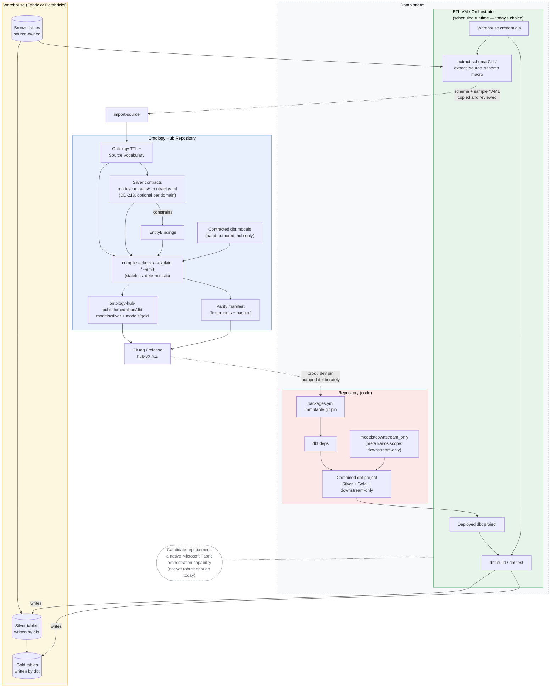

# Ontology, dbt, and Dataplatform: Design Architecture

## Purpose

This document defines the architecture for how an ontology hub governs source discovery,
bronze-to-canonical bindings, and Silver-layer dbt generation, and how that generated output is
consumed safely by a separate dataplatform repository that owns live warehouse connections and
runtime execution. It is a living architecture reference, not a single delivery ticket — each
capability below should land independently, with its own design-decision record where it changes
existing behavior.

The scope spans five concerns that have different owners and different failure modes: live source
introspection and profiling; source-schema drift detection; the declaration of the Silver contract
itself and binding conformance to it; compatibility between released Silver contracts; and
cross-repository authoring and release governance. These are kept as separate,
independently deliverable capabilities joined through versioned, machine-readable artifacts —
never as one combined program — because bundling them produces a change no one can review,
test, or roll back incrementally.

## System overview

The dataplatform boundary contains two distinct components, drawn separately because they change
independently and fail independently: the **repository** (code — pinned package, combined project,
downstream-only models), which holds no credentials and runs nothing by itself; and the **ETL VM /
orchestrator**, the scheduled runtime that deploys that code and holds the warehouse credentials
both `dbt build`/`dbt test` and the live extraction job need. The VM is today's implementation
choice, not a permanent architectural commitment — a native Microsoft Fabric orchestration
capability is a plausible future replacement for it, but isn't yet at the robustness level this
needs, so the boundary is drawn around "the dataplatform's runtime," not around "a VM" specifically,
to keep that substitution cheap when it becomes viable.

Gold is generated by the same hub compiler as Silver and lands in the same combined dbt project
(`models/gold`, depending on `models/silver` within the warehouse) — it is not a separate pipeline
or a separate hub-to-dataplatform handoff, only a further layer in the same emitted project, built
by the same `dbt build` run.

Authored dbt seeds (`integration/transforms/dbt/seeds/`, emitted to the combined project's
`seeds/`) are a similar emitted-artifact case not yet fully covered by this document: they carry no
domain association today, so unlike `models/silver`/`models/gold` there is no natural per-domain
`+schema` to give them, and the generated `dbt_project.yml` has no `seeds:` config block at all —
seeds land in the warehouse's default schema with adapter-dependent type inference (tracked as
issue #596). Deciding a target medallion layer/schema for seeds, and whether to derive
`column_types` from an extended seed properties sidecar, is the same class of decision this
document governs for Silver/Gold and should be made alongside it rather than as a standalone fix.

Only two crossings remain genuinely human-reviewed rather than mechanical, and are the only dashed
arrows carrying a labeled decision: a release tag being deliberately adopted as a dataplatform's
`packages.yml` pin, and extracted schema/sample evidence being copied and reviewed before
`import-source` commits it back into the hub's vocabulary. (The dotted line to the Fabric-native
note is a different kind of dashed line — an annotation about a future alternative, not a data or
control flow.) Every other arrow — including the VM deploying the project and running against real
Bronze/Silver/Gold tables — is a mechanical, automatable step once those two deliberate decisions
have been made.

## Architectural design choices

Each choice below states the decision and the reason it was made, so future changes can be
weighed against the same reasoning rather than only against the resulting rule.

### Repository and ownership boundaries

**The ontology hub and the dataplatform are separate repositories with non-overlapping
responsibilities.** The hub owns ontology, source vocabulary, Silver contracts, bindings,
contracted dbt inputs,
stateless compilation, compile diagnostics, deterministic emitted artifacts and parity manifests,
comparison of two supplied Silver contract manifests, and release evidence describing exactly what
was compiled. The dataplatform owns credentials and live warehouse access, extraction schedules
and profiling budgets, storage of previous extraction state, real `dbt build`/`dbt test`, runtime
data-quality alerting, immutable hub artifact pins, and downstream-only dbt models plus their
policy lint.
*Why:* the hub must never hold credentials or depend on live warehouse access to stay
stateless and testable offline; the dataplatform is the only place that can safely run real
queries and real dbt builds. Splitting responsibility this way means a hub compile can never be
blocked or corrupted by warehouse availability, and a warehouse outage never touches ontology
state.

**Real `dbt build`/`dbt test` execution — and the schema-drift/data-quality alerting derived from
actual runtime data — happens only in the dataplatform repository, never in the hub.**
*Why:* the hub's own dbt validation is limited to parsing and compiling the generated project
(syntax and structural checks only); running it against real data requires credentials the hub
must never hold. Discovering a real problem there and needing to fix it in the ontology is not a
design flaw to eliminate — it is the intended feedback loop, catching a modeling error near its
source rather than letting it reach a downstream consumer silently.

**Projection always runs in the hub, at compile time; a projection target repository (the
dataplatform, or any other downstream consumer) only ever receives already-rendered output, never
the projector code executing against its own inputs.** Concretely for the medallion/dbt path: the
hub renders `.sql`/`.yml` text via `compile --emit` and commits it to
`ontology-hub-publish/medallion/dbt`; the dataplatform consumes that rendered tree as a pinned
`packages.yml` dependency and never invokes the toolkit's projector. The dataplatform does depend
on the toolkit package today, but only for the `extract-schema` CLI (live introspection) — an
auxiliary tool, not something that gates what ships to production. This is a general rule, not a
dbt-specific one: it applies identically to every other projection target the toolkit supports
(Power BI/dimensional semantic models, MDM profiles, Azure Search index configs, Neo4j graph
exports, prompt/LLM context bundles). Each one's target repository or system should consume a
rendered artifact from the hub, never execute the corresponding projector itself.
*Why:* a pinned tag is only a true determinism guarantee if the artifact it points to is the exact
bytes that will run — if projection happened downstream instead, the same pinned tag could render
different output depending on whatever toolkit version happened to be installed at render time,
silently reopening the non-determinism the release-compatibility design exists to close. Keeping
projection in the hub also means a hub PR shows the literal rendered artifact changing, reviewable
before publish, rather than asking reviewers to trust that a projector running somewhere else will
render an ontology/binding diff correctly; and it keeps every downstream/target repository's
dependency footprint limited to what it actually runs (`dbt-core` and an adapter, for the
dataplatform) rather than the full toolkit and its transitive rendering dependencies becoming a
load-bearing part of every target's build.

### Release and compatibility safety

**The Silver contract is a declared, authored artifact that bindings conform to — never a shape
derived from whatever the bindings happen to say.** It used to be the latter: model name, column
name, column set, and column order were all computed from the bindings (`compiler/adapter.py`,
`compiler/kernel.py`, DD-133 §8b), so deleting a `fields:` entry dropped a column, reordering
`fields:` changed the parity fingerprint, renaming an ontology property renamed the physical
column, and onboarding a second source to a class *had to* reshape the model because
`conformance.property-incompatible` requires identical property sets across a group.

[DD-213](decisions/dd-213-the-silver-contract-is-declared-not-derived--bindings-conform-to-it.md)
introduces `model/contracts/<domain>.contract.yaml` as a third authored input between ontology
and bindings. It lands in two gates, and only the first is built:

- **Gate A — compile-time conformance — is implemented.** `core/compiler/contracts.py`,
  `contract_conformance.py`, `contract_emission.py` and `contract_scaffold.py` supply a
  `contract.*` diagnostic family of 24 rules, covered by `tests/test_compiler_contracts.py`.
  The contract file is **optional per domain**: an ungoverned domain emits no `contract.*`
  diagnostics and compiles as it did before
  (`test_absent_contract_directory_leaves_scope_empty`,
  `test_ungoverned_domain_emits_no_contract_diagnostics`).
- **Gate B — release-time comparison of a candidate contract against its released
  predecessor — is not built.** There is no comparator and no CLI command; see Phase 5 in
  [roadmap.md](roadmap.md).

*Why:* a contract must constrain its implementations; while each implementation redefined the
contract, the failure happened during ordinary source onboarding — before any release process
could observe it. The contract is an *interface declaration*, not readiness or coverage state
(retired by DD-133 §9), and it is authored input rather than derived history, so `compile
--check` stays stateless and no generated baseline appears under `model/`.

**Compatibility between two Silver releases is proven by comparing two already-emitted parity
manifests, never by introducing a second, checked-in schema baseline inside the hub's authored
input tree.** The manifest already carries deterministic model fingerprints, ordered columns,
per-field hashes, and hashes of every rendered representation — enough to prove internal
consistency within one release candidate; comparing two of them proves consistency across
releases.
*Why:* a generated baseline living under the hub's authored `model/` tree would create a second
source of truth that conflicts with the existing separation between authored hub inputs and
derived `ontology-hub-publish/` output. It would also make an ordinary `compile --check` depend on
mutable historical state instead of only the hub's current inputs — `compile --check` must stay
stateless and independent of Git history.

**A release tag alone does not prove consistency.** The release gate binds five values together:
the hub Git commit, toolkit and reference-model versions, `CompilePlan` identity/provenance, the
emitted parity-manifest hash, and the immutable artifact or Git revision the dataplatform actually
consumes.
*Why:* compilation is deterministic — one commit always produces one result — but that only
protects a release if the automation that cuts it actually emitted from that exact commit,
validated the result, and published the matching artifact tree. "Pin a tag" is not sufficient on
its own if nothing proves the tagged revision contains the artifact it claims to.

**SemVer classification for a hub release is comparator-assisted and human-approved, never fully
automatic.** A comparator can classify structural compatibility (unchanged, additive-compatible,
breaking, behavior-sensitive, unknown) and recommend a minimum version bump; a human makes the
final release decision, and any unknown or unclassified change blocks by default rather than being
treated as safe.
*Why:* "no contract diff means PATCH, additions mean MINOR, removals mean MAJOR" is not a safe
algorithm on its own — a release with no Silver diff can still change runtime behavior, an added
required/non-null column can be breaking, a type widening can be safe on one adapter and breaking
on another, a structurally unchanged column can change semantic meaning, and dbt contracts,
downstream `select *` usage, BI models, and package-qualified `ref()`s can each have different
compatibility constraints a structural diff cannot see.

**dbt's native model-versioning feature (`versions:`) is a separate design effort, started only
once release compatibility reporting and reproducible releases are operational — not bundled into
this architecture as a schema-only enhancement.** A complete design must answer: what stable
logical identity survives a model rename; how old SQL implementations are retained without
re-reading old hub state; how a binding or cross-domain relationship selects a version; how
sequential domain emits preserve versions owned by another domain; how latest version, deprecation
date, and removal release are declared; how Gold, MDM, tests, and package consumers select the
same version consistently; and what migration is generated for existing unversioned models.
*Why:* emitting a `versions:` block is the smallest visible part of model versioning. Shipping
that YAML without the rules above would advertise a coexistence guarantee the generated dbt
project cannot actually provide. Until this design is accepted, breaking Silver changes require a
coordinated major release rather than a quiet parallel rollout.

**One command matrix is kept consistent across every doc, skill, and scaffold** — emission is
always `compile <domain> --emit --confirm-emit`, never bare `--emit`; live schema extraction has
one clearly designated primary path, not two tools presented as interchangeable.
*Why:* conflicting operational guidance is itself a source of production incidents. Guidance must
be internally consistent before new capability is layered on top of it.

### Extraction and profiling design

**Live-extraction profiling depth is an explicit option owned by the extraction job (and
optionally a dataplatform-owned config), never a field on `EntityBinding`.**
*Why:* `EntityBinding` is a closed source-to-canonical execution contract with no arbitrary
metadata extension point, and for good reason — a source can and should be extractable and
profilable before it has any binding at all, and live-query cost and credentials belong to the
dataplatform that owns them, not to hub compilation. Mixing runtime introspection policy into a
binding would blur that boundary and risks silently altering `CompilePlan` semantics.

**Structural introspection and expensive profiling are two explicit stages, not one extraction
pass.** Structural metadata — relations, columns, types, nullability, primary keys, and declared
foreign keys where the adapter exposes them — is cheap and safe to run every time. Profiling — row
counts, distinct counts, enum candidates, and samples — runs deliberately: on changed tables,
explicitly requested tables, or a scheduled periodic full pass, driven by a deterministic
structural fingerprint computed per table and for the extraction as a whole.
*Why:* if structural drift detection and profiling are one pass, every drift check pays full
profiling cost, and "skip profiling when structure is unchanged" is impossible to implement
correctly — the expensive query would already have run before the comparison that was supposed to
avoid it.

**Declared foreign keys (read from adapter/warehouse metadata) and inferred relationships (from
naming conventions or binding heuristics) are kept structurally distinct in every representation —
YAML, TTL, and reports — never merged into one relationship concept.**
*Why:* conflating a database-declared constraint with a heuristic guess would silently launder
inference as fact. Downstream consumers need to know, unambiguously, which kind of relationship
they are looking at.

**Joined, foreign-key-aware sampling across tables is not run by default.** It is designed
separately, later, with explicit selected relationships, deterministic ordering, fan-out limits,
and an enforced query budget.
*Why:* sampling that follows relationships without those constraints risks expensive,
non-deterministic queries that behave inconsistently across adapters — not something to default
on before the guardrails exist.

**Enum-value evidence collection is bounded by explicit limits**: maximum distinct cardinality,
maximum bytes and values returned, deterministic ordering, redaction before persistence, and
recorded truncation metadata when a limit is hit.
*Why:* an unbounded `DISTINCT`/`GROUP BY` against a high-cardinality column is an unbounded-cost
query that can also expose more raw values than intended — the limits must exist before the
capability does.

**Stratified/representative sampling is not a default extraction behavior.** It requires explicit
sampling inputs, a query-budget policy, privacy checks, and adapter-specific query plans before it
is introduced.
*Why:* partitioning by unknown category columns can create expensive sorts, amplify exposure of
sensitive values, and behaves differently across Fabric and Databricks — none of which is safe to
default on silently.

**Schema drift is exposed as a read-only, machine-readable comparison API** — stable JSON output,
meaningful exit codes, deterministic change codes, no timestamps baked into the structural
fingerprint, and no file-write side effects — separate from the explicit apply/write operation
that commits an accepted schema to the vocabulary.
*Why:* a scheduled, cross-repository automation needs a stable machine contract, not
human-oriented CLI text. Coupling automated drift detection to the same operation that writes
vocabulary/TTL risks an automated job making unintended writes.

### Governance enforcement

**The boundary between hub-authored, ontology-relevant transform logic (grain, identity,
survivorship — authored in the hub as contracted dbt models) and dataplatform-only logic
(connection tuning, warehouse-specific hints — authored downstream) is reinforced with tooling, not
documentation or a folder rename alone.** Concretely: a hub-side scaffold command that creates the
ordinary dbt SQL, its authoritative properties contract, required metadata fields, and optionally
a binding stub in one step; and a dataplatform-side lint requiring an explicit
`meta.kairos.scope: downstream-only` declaration on every non-generated model, wired into
scaffold CI and the PR template.
*Why:* renaming an escape-hatch folder does not migrate existing consumer repositories, and a
naming-prefix check is trivially bypassed and cannot detect semantic survivorship or grain logic
hiding in a "custom" model. The durable fix is making the correct path faster to use than the
workaround, backed by an explicit, reviewable declaration as a tripwire. This raises friction and
review visibility — it does not, and cannot, prove SQL semantics on its own.

### dbt Core version strategy

**Dependency pins on `dbt-core` and its adapters always carry an explicit upper bound below the
next major line, and any floor bump is adapter-aware rather than a single shared version
string.** As of 2026-08-22: dbt Core 2.0 — the former Fusion engine, a Rust rewrite now merged
into the `dbt-core` project itself rather than a separate product — is in beta (`v2.0.0-beta.2`,
released 2026-08-18), targeting full behavioral parity with v1.x under a stricter codified
language spec, alongside a new Parquet-backed local metadata index. It is Apache-2.0 licensed, and
dbt Labs has committed to continued v1.x maintenance on its own release branch. Checked directly
against adapter release history: `dbt-databricks` has already reached the 1.12 line (v1.12.4);
`dbt-fabric`, this toolkit's default adapter, is one minor behind at v1.11.1 and has no 1.12
release yet. Neither adapter has a 2.0-line release.
*Why:* dbt Labs' own roadmap states that adapter maintainers must explicitly port to a new,
verticalized adapter layer for Core 2.0 — it is not a drop-in bump, and the generated project has
not been validated against the stricter v2.0 language spec. An open, floor-only adapter pin (no
upper bound) would let a routine dependency sync silently resolve into a pre-GA, unvalidated major
version the moment one ships. Because the default adapter (Fabric) itself lags dbt-core's own
1.12 line, any future floor increase must be justified per adapter, not assumed to apply equally
to both.

Two already-shipped dbt features are directly relevant to work described later in this document
and worth tracking even before Core 2.0 reaches general availability: `latest_version_pointer`
(dbt Core v1.12) auto-creates a view pointing at the current version of a versioned model, which
the model-versioning design above should build around rather than retrofit later — confirm Fabric
adapter support before relying on it, since Fabric is not yet on 1.12; and `--sample` mode (dbt
Core v1.10, available on both adapters' current releases) provides time-window-based sampling
across a DAG for cheaper development/CI runs — a different tool from the representative/profiling
sampling described above (it answers "can I run this DAG cheaply," not "what examples best explain
this table's contents"), safe to adopt independently in the dataplatform repository's own
development workflow. `dbt build --write-index` (Core 2.0-line only) queries warehouse metadata
for row-count/byte/last-modified statistics into the new Parquet index; once it reaches general
availability with adapter support, it may be cheaper to consume than hand-rolled equivalent
queries — worth a build-vs-consume check immediately before that extraction work begins, not a
reason to delay it now. Separately, this toolkit's existing dbt integrations already invoke the
`dbt` CLI via subprocess rather than depending on dbt's Python API, which the Core 2.0 roadmap
confirms is not yet at parity for the new engine — meaning the existing integration approach is
already forward-compatible with the 2.0 transition by construction.

## Operating model

### Hub repository owns

- ontology, source vocabulary, Silver contracts, bindings, and contracted dbt inputs;
- stateless compilation and compile diagnostics;
- deterministic emitted artifacts and parity manifests;
- comparison of two supplied Silver contract manifests; and
- release evidence describing exactly what was compiled.

### Dataplatform repository owns

- credentials and live warehouse access;
- extraction schedules and profiling budgets;
- storage of previous extraction state;
- real `dbt build` and `dbt test`;
- runtime data-quality alerting;
- immutable hub artifact pins; and
- downstream-only dbt models and their policy lint.

### Release workflow owns

- selecting the previous released contract;
- emitting a candidate from the exact release commit;
- compatibility comparison;
- human-approved version classification;
- immutable publication; and
- evidence that the dataplatform pin resolves to the published candidate.

## Delivery roadmap

The phased plan, the model-versioning effort, the suggested issue breakdown and the
minimum first release moved to [roadmap.md](roadmap.md). This document describes the
architecture as it stands; the roadmap describes what is not built yet. Keeping them in
one file made it impossible to tell which half you were reading.
