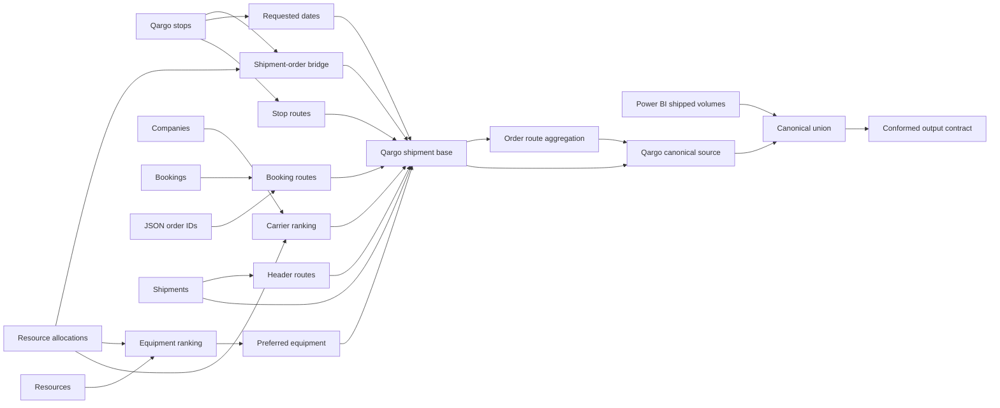

# Custom dbt Transformation Extensibility

**Status:** Draft design proposal  
**Scope:** Kairos ontology-to-dbt projection  
**Example:** Bronze-to-Silver Shipment conformance

## 1. Decision summary

Kairos should support complex Bronze-to-Silver logic through **contracted custom dbt
models bundled into the generated dbt package**.

The custom model remains handwritten SQL and owns joins, windows, aggregations, fallback
rules, and grain changes. Kairos owns the semantic contract at its output boundary and
continues to generate the final Silver model, keys, relationships, SCD behavior, tests,
and documentation where possible.

The design should not:

- encode the complete SQL execution graph in RDF;
- inject arbitrary CTE strings into generated models;
- make a generated package depend on consumer-owned dbt models; or
- introduce a second output-to-property mapping mechanism alongside SKOS.

## 2. Problem

The existing Kairos mapping vocabulary is suitable when a Silver entity can be produced
from:

- direct source-to-property mappings;
- column expressions;
- row filters;
- deduplication;
- standard foreign-key lookups; or
- independently normalized sources combined with `UNION ALL`.

The CLdN Shipment model is more involved. It combines shipment, order, stop, booking,
resource, company, and JSON-expanded data through:

- shipment-to-order bridge construction;
- joins across several Qargo tables;
- conditional aggregation;
- window ranking and preferred-record selection;
- route fallback resolution;
- reusable dbt macros;
- multiple grain changes; and
- conformance of Power BI and Qargo records into one output.

Representing this complete graph in RDF would reproduce dbt SQL with greater verbosity
and weaker authoring, compilation, debugging, and testing support. Keeping the complete
final Silver model handwritten, however, would bypass ontology-driven keys,
relationships, tests, and documentation.

The required extensibility point is therefore a boundary between:

1. complex source conformance implemented in dbt; and
2. ontology-aligned Silver projection implemented by Kairos.

## 3. Current architectural constraints

The design must respect the existing producer/consumer architecture:

- The ontology hub produces a self-contained dbt package under
  `output/medallion/dbt/`.
- A downstream dataplatform repository consumes that package.
- A package model cannot safely depend on an arbitrary model defined only in the
  consuming root project.
- Generated output may be recreated, so handwritten source files must not live only
  inside the generated output tree.
- Existing `silverSourceRef` redirects a generated model to `ref()`, but column
  discovery still depends on a declared source vocabulary. It is not by itself a
  complete custom-transformation contract.
- dbt parse and compile validate graph structure and SQL/Jinja syntax, but do not
  generally prove the output columns and types of arbitrary SQL.

These constraints require the custom model, macros, output contract, and generated
Silver wrapper to be assembled into one dbt package before validation and publication.

## 4. Goals

1. Keep OWL focused on business semantics.
2. Keep complex relational logic in native dbt SQL.
3. Produce one self-contained, versioned dbt package.
4. Never overwrite the authoritative handwritten SQL source.
5. Reuse the existing SKOS mapping vocabulary.
6. Preserve toolkit ownership of SK, IRI, SCD, FK, tests, and documentation where
   practical.
7. Make grain and identity explicit before key generation.
8. Distinguish declared lineage from lineage that can actually be verified.
9. Keep existing simple mappings unchanged.

## 5. Non-goals

- Defining relational algebra or a SQL AST in RDF.
- Generating arbitrary joins, windows, or aggregations from Turtle.
- Replacing dbt compilation, testing, or documentation.
- Supporting opaque SQL without an output contract.
- Guaranteeing column-level lineage through arbitrary SQL from the dbt manifest alone.
- Allowing a generated package to reference undeclared consumer models.

## 6. Proposed repository layout

Authoritative custom dbt inputs should live outside generated output:

```text
integration/
  transforms/
    dbt/
      models/
        intermediate/
          shipment/
            int_shipment_conformed.sql
            _shipment_contract.yml
      macros/
        qargo_company_description.sql

integration/
  sources/
    custom-transformations/
      shipment-conformed.vocabulary.ttl

model/
  mappings/
    custom-transformations/
      shipment-conformed-to-logistics.ttl

model/
  extensions/
    logistics-silver-ext.ttl

output/
  medallion/
    dbt/
      models/
        intermediate/
          shipment/
            int_shipment_conformed.sql
            _shipment_contract.yml
        silver/
          logistics/
            shipment.sql
      macros/
        qargo_company_description.sql
```

Files under `integration/transforms/dbt/` are user-owned inputs. The projector copies
them into the generated package. The copied artifacts under `output/medallion/dbt/` may
be replaced on every projection because they are not the authoritative source.

This produces one dbt graph:

```text
Bronze sources and bundled staging inputs
                    |
                    v
Bundled int_shipment_conformed
                    |
                    v
Toolkit-generated silver shipment
                    |
                    v
Downstream package consumer
```

## 7. Resolve grain before implementation

The current Shipment SQL states a grain of one order on a sailing or route. Its Qargo
identity uses `shipment_id + order_id`, while its Power BI fallback uses
`order_no + shipping_route + shipping_planned_date`.

This may not represent a business `Shipment`. It may represent an association such as:

- `ShipmentOrder`;
- `ShipmentMovement`; or
- `ShipmentOrderMovement`.

This is a design prerequisite, not a validation warning to defer until projection.
Before creating a custom transformation contract:

1. Confirm the semantic target class.
2. Define one canonical output grain.
3. Define a natural key valid for every source branch.
4. Confirm whether records from different source systems can represent the same
   business entity.
5. Define deduplication or survivorship if identities overlap.

The examples below continue to use `Shipment` for readability, but that name is not
approved by this proposal.

## 8. Transformation declaration

A dedicated annotation should distinguish a custom transformation from
`silverSourceRef`, which currently serves expanded-source scenarios:

```turtle
@prefix kairos-ext: <https://kairos.cnext.eu/ext#> .
@prefix log:        <https://cldn.com/ont/logistics#> .

log:Shipment
    kairos-ext:silverTransformationRef "int_shipment_conformed" ;
    kairos-ext:naturalKey "canonicalShipmentId" ;
    kairos-ext:scdType "1" ;
    kairos-ext:isReferenceData "false"^^xsd:boolean .
```

`silverTransformationRef` means:

1. The referenced model must exist in `integration/transforms/dbt/`.
2. It must be copied into the generated dbt package.
3. It must have a declared virtual-source vocabulary and dbt contract.
4. Generated Silver SQL must use `ref('int_shipment_conformed')`.
5. Source-column resolution must use the virtual-source vocabulary rather than the
   original Bronze table vocabulary.

This is a distinct code path. It should not be implemented as a simple alias for
`silverSourceRef`.

## 9. Virtual-source vocabulary

The custom model output should be treated as a virtual source table. This allows Kairos
to reuse its existing source-column and SKOS mapping machinery instead of introducing
`OutputBinding`.

Illustrative vocabulary:

```turtle
@prefix owl:          <http://www.w3.org/2002/07/owl#> .
@prefix rdfs:         <http://www.w3.org/2000/01/rdf-schema#> .
@prefix xsd:          <http://www.w3.org/2001/XMLSchema#> .
@prefix kairos-bronze: <https://kairos.cnext.eu/bronze#> .
@prefix custom:       <https://cldn.com/source/custom-transformation#> .

custom:shipmentConformed
    a kairos-bronze:Table ;
    rdfs:label "Conformed Shipment transformation output" ;
    kairos-bronze:physicalName "int_shipment_conformed" .

custom:shipmentConformed_canonicalShipmentId
    a kairos-bronze:Column ;
    kairos-bronze:belongsToTable custom:shipmentConformed ;
    kairos-bronze:physicalName "canonical_shipment_id" ;
    kairos-bronze:dataType "string" ;
    kairos-bronze:nullable "false"^^xsd:boolean .

custom:shipmentConformed_shippingRoute
    a kairos-bronze:Column ;
    kairos-bronze:belongsToTable custom:shipmentConformed ;
    kairos-bronze:physicalName "shipping_route" ;
    kairos-bronze:dataType "string" .

custom:shipmentConformed_loadStatus
    a kairos-bronze:Column ;
    kairos-bronze:belongsToTable custom:shipmentConformed ;
    kairos-bronze:physicalName "load_status" ;
    kairos-bronze:dataType "string" .
```

The exact Bronze predicates should follow the toolkit's established vocabulary. The
important design point is that the conformed model has a machine-readable table and
column contract.

## 10. Reuse SKOS mappings

The virtual source is mapped to the ontology through normal SKOS statements:

```turtle
@prefix skos:       <http://www.w3.org/2004/02/skos/core#> .
@prefix kairos-map: <https://kairos.cnext.eu/mapping#> .
@prefix custom:     <https://cldn.com/source/custom-transformation#> .
@prefix log:        <https://cldn.com/ont/logistics#> .

custom:shipmentConformed
    skos:exactMatch log:Shipment ;
    kairos-map:mappingType "direct" .

custom:shipmentConformed_canonicalShipmentId
    skos:exactMatch log:canonicalShipmentId .

custom:shipmentConformed_shippingRoute
    skos:exactMatch log:shippingRoute .

custom:shipmentConformed_loadStatus
    skos:exactMatch log:loadStatus .
```

No new output-binding vocabulary is needed. Mapping reports and coverage calculations
can continue to use the same SKOS model, with the virtual source identified as a custom
transformation output.

Detailed business-rule descriptions may be attached to the virtual column or mapping,
but they are documentation rather than executable SQL:

```turtle
custom:shipmentConformed_loadStatus
    rdfs:comment
        "Derived by the custom model: COBCON debtor shipments are Empty; all others Full." .
```

## 11. dbt output contract

The custom model should include an explicit dbt contract:

```yaml
version: 2

models:
  - name: int_shipment_conformed
    description: Canonical shipment-order transformation consumed by Kairos Silver.
    config:
      contract:
        enforced: true
    meta:
      kairos_target_class: https://cldn.com/ont/logistics#Shipment
      kairos_virtual_source: https://cldn.com/source/custom-transformation#shipmentConformed
    columns:
      - name: canonical_shipment_id
        data_type: string
        constraints:
          - type: not_null
        data_tests:
          - unique
          - not_null

      - name: order_no
        data_type: string

      - name: shipping_route
        data_type: string

      - name: load_status
        data_type: string
        data_tests:
          - accepted_values:
              arguments:
                values: ["Full", "Empty"]
```

The vocabulary and dbt contract intentionally overlap on names and types:

- The vocabulary supports offline ontology mapping and generation.
- The dbt contract enforces the relation when the project executes.
- Kairos compares them and reports mismatches before publishing the package.

dbt compilation alone must not be described as proof of the output schema.

## 12. Shipment custom model

The existing multi-CTE logic remains native dbt SQL:



The custom model should expose canonical business values rather than final physical
Silver keys:

```sql
select
    case
        when source_entity_id is not null
            then {{ dbt.concat([
                "source_system", "'|'", "source_entity_id"
            ]) }}
        else {{ dbt.concat([
            "source_system", "'|'",
            "coalesce(order_no, '')", "'|'",
            "coalesce(shipping_route, '')", "'|'",
            "coalesce(cast(shipping_planned_date as "
                ~ dbt.type_string() ~ "), '')"
        ]) }}
    end as canonical_shipment_id,

    order_no,
    debtor_search_name as customer_number,
    booking_reference,
    shipping_planned_date,
    shipping_route_key,
    shipping_route,
    shipping_routes,
    transport_medium,
    transport_medium_type_descr,
    shipping_requested_date,
    company_description,
    debtor_first_name,
    debtor_search_name,
    load_status,
    source_system,
    source_record_id
from canonical_sources
```

The custom model owns:

- bridge construction;
- source joins;
- equipment and carrier ranking;
- JSON extraction and joins;
- route fallback precedence;
- route-list aggregation;
- source-specific normalization;
- source union; and
- canonical business-key derivation.

The generated Silver model normally owns:

- surrogate key and IRI generation;
- ontology-driven FK resolution;
- SCD policy;
- SHACL-derived tests;
- generated documentation; and
- semantic mapping lineage from the virtual source boundary.

## 13. Generated Silver wrapper

Conceptually, the generated model consumes the bundled custom model:

```sql
with source as (
    select *
    from {{ ref('int_shipment_conformed') }}
)

select
    {{ dbt_utils.generate_surrogate_key([
        'canonical_shipment_id'
    ]) }} as shipment_sk,

    concat(
        'https://cldn.com/ont/logistics#Shipment/',
        canonical_shipment_id
    ) as shipment_iri,

    transport_order.transport_order_sk as order_sk,
    customer.customer_sk,
    shipping_route.shipping_route_sk,

    source.shipping_route,
    source.shipping_routes,
    source.transport_medium,
    source.transport_medium_type_descr,
    source.shipping_requested_date,
    source.shipping_planned_date,
    source.booking_reference,
    source.load_status,
    source.company_description,
    source.source_system,
    source.source_record_id

from source

left join {{ ref('transport_order') }} transport_order
    on source.order_no = transport_order.order_number

left join {{ ref('customer') }} customer
    on source.customer_number = customer.customer_number

left join {{ ref('shipping_route') }} shipping_route
    on source.shipping_route_key = shipping_route.shipping_route_key
```

The actual joins must be generated from object-property annotations, target natural
keys, and SKOS mappings. The example does not prescribe literal join generation.

## 14. Foreign-key behavior is a migration

The existing Shipment SQL creates several FK values by hashing business columns
directly. The proposed wrapper may instead join to target Silver entities using their
natural keys.

These approaches are not automatically equivalent. Before migrating each FK, confirm:

- the target model exists in the generated package;
- the target has a declared natural key;
- the custom model emits every required natural-key component;
- the target natural key is unique;
- null and orphan behavior is acceptable;
- join fan-out cannot change the Shipment grain; and
- the generated SK algorithm matches downstream expectations.

If a relationship cannot satisfy those conditions, the custom transformation may need
to retain responsibility for that key temporarily. Such exceptions must be explicit in
the contract rather than silently mixed with generated FK behavior.

## 15. Packaging and generation lifecycle

Projection should execute these steps:

1. Discover custom dbt inputs under `integration/transforms/dbt/`.
2. Validate paths, model names, and duplicate artifact names.
3. Load virtual-source vocabularies and SKOS mappings.
4. Confirm that every `silverTransformationRef` resolves to one custom model.
5. Copy custom models, macros, tests, and contracts into a temporary package assembly.
6. Generate Silver wrappers into that same assembly.
7. Verify there are no duplicate dbt model names or cyclic `ref()` dependencies.
8. Compare virtual-source columns and types with the checked-in dbt contract.
9. Run dbt parse or compile when the configured adapter and dependencies are available.
10. Publish the assembled package to `output/medallion/dbt/`.

The assembly should be atomic: validation failure must not leave a partially updated
generated package.

Custom model dependencies must also be self-contained. A custom model may reference:

- dbt `source()` declarations included in the package;
- generated or bundled staging models included in the package;
- bundled macros; and
- dependencies declared in the package's `packages.yml`.

It must not depend on an undeclared model that only exists in a future consumer.

## 16. Validation boundaries

### 16.1 Deterministic offline checks

Kairos can verify without a warehouse:

- custom source files exist;
- model and macro names are unique;
- transformation references resolve;
- target ontology classes and properties exist;
- virtual-source columns are mapped through SKOS;
- natural-key columns are declared;
- vocabulary and dbt-contract names and types agree;
- FK source-key shapes match target natural-key shapes;
- generated and custom refs form an acyclic package graph;
- handwritten files are outside generated output; and
- required dbt packages and macros are declared.

### 16.2 dbt graph checks

When dbt dependencies and an adapter are available:

- `dbt parse` validates graph construction;
- `dbt compile` validates SQL/Jinja compilation;
- the manifest confirms model-level dependencies;
- the generated wrapper resolves the custom model; and
- declared model dependencies can be compared with manifest dependencies.

These checks do not prove the runtime output relation.

### 16.3 Runtime checks

Execution or warehouse-backed CI is required to verify:

- enforced dbt model contracts;
- actual output column types;
- grain uniqueness;
- non-null natural-key values;
- accepted values such as `Full` and `Empty`;
- FK relationship integrity;
- bridge and ranking duplicate behavior; and
- absence of join fan-out in the generated wrapper.

## 17. Lineage model

The design exposes three different lineage levels:

| Level | Source | Guarantee |
|---|---|---|
| Model dependency | dbt manifest | Which models and sources are referenced |
| Semantic boundary | SKOS mapping | Which custom output column maps to which ontology property |
| Internal column derivation | SQL parser or explicit metadata | Which Bronze columns contributed to an output |

The first two are required. The third is optional unless a future SQL-lineage component
can verify it reliably.

Descriptions such as the `load_status` business rule are useful documentation, but they
must not be presented as mechanically verified column lineage.

## 18. Ownership and regeneration

| Location | Owner | Regeneration behavior |
|---|---|---|
| `integration/transforms/dbt/**` | User | Never overwritten |
| `integration/sources/custom-transformations/**` | User/tool-assisted design | Never overwritten by projection |
| `model/mappings/**` | User/tool-assisted design | Never overwritten by projection |
| `model/extensions/**` | User/tool-assisted design | Never overwritten by projection |
| `output/medallion/dbt/**` | Toolkit | Recreated from authoritative inputs |

The toolkit should reject custom source files placed directly inside managed output or
make it explicit that they will be replaced.

## 19. Adapter and dependency contract

The Shipment SQL contains adapter-sensitive expressions and reusable macros. A custom
transformation must declare:

- supported dbt adapter or SQL dialect;
- required dbt packages;
- required macros;
- expected source relation names; and
- any materialization constraints.

For example:

```yaml
meta:
  kairos:
    supported_adapters:
      - databricks
      - spark
    required_packages:
      - dbt-labs/dbt_utils
```

Projection should warn or fail when the target platform is incompatible with the
custom transformation.

## 20. Extensibility levels

| Level | Pattern | Handling |
|---|---|---|
| 1 | Direct columns, casts, defaults, filters | Existing generated mapping |
| 2 | Standard FK lookup or multi-source union | Existing generated mapping |
| 3 | Repeated standard transformation | Optional shared dbt macro/model |
| 4 | Joins, windows, aggregates, grain changes | Bundled custom dbt transformation |
| 5 | Complete exceptional Silver implementation | Explicit custom final-model override |

Level 5 is a last resort. It gives the custom model responsibility for keys, SCD, FKs,
and tests and therefore reduces what Kairos can guarantee.

## 21. Alternatives considered

### Full RDF transformation DAG

Rejected for the initial design. It duplicates dbt SQL and requires Kairos to become a
general transformation compiler.

### Injected custom CTE

Rejected. It is difficult to validate independently, fragile during regeneration, and
less visible in dbt lineage.

### Consumer-owned intermediate model

Rejected as the default. A generated package cannot safely depend on a model that only
exists in an unknown consuming root project.

### Upstream physical conformed source

Viable when the organization deliberately materializes conformed data before running
the ontology package. Kairos can then treat it as a normal `source()`.

However, `source()` does not create a dbt dependency on the model that materialized the
relation. This approach therefore requires separate orchestration phases or an external
pipeline dependency.

### Fully handwritten Silver model

Supported only as an explicit final-model override. It preserves maximum dbt
flexibility but moves most physical and semantic guarantees outside the generator.

### External YAML transformation DSL

Not recommended unless visual or non-SQL authoring becomes a primary product
requirement. Otherwise it creates another transformation language without replacing
SQL.

## 22. Incremental delivery

### Phase 1: Bundle and resolve

- Add the protected `integration/transforms/dbt/` input location.
- Copy custom dbt artifacts into the generated package.
- Add `silverTransformationRef`.
- Add virtual-source vocabulary support.
- Reuse existing SKOS mappings.
- Detect name collisions and unresolved refs.

### Phase 2: Contract validation

- Require dbt model contracts for custom transformation outputs.
- Compare contracts with virtual-source vocabularies.
- Validate natural-key and FK lookup shapes.
- Add adapter and package dependency checks.

### Phase 3: Graph and reporting

- Parse or compile the assembled package.
- Add model-level transformation lineage to reports.
- Show the custom-model boundary distinctly in coverage reports.
- Add runtime audit recommendations for grain and join fan-out.

### Phase 4: Reusable components

- Identify repeated transformations suitable for shared macros or intermediate models.
- Keep arbitrary entity orchestration in handwritten dbt SQL.

## 23. Open questions

1. Is `Shipment` the correct class for the shipment/order grain?
2. Should all custom dbt inputs use `integration/transforms/dbt/`, or should the path be
   configurable?
3. Should custom transformation vocabularies use the existing Bronze namespace or a
   dedicated virtual-source type that remains compatible with Bronze parsing?
4. Which dbt contract fields are mandatory for offline validation?
5. How should exceptional precomputed surrogate keys be declared?
6. Which adapters must a custom transformation support before it can be packaged?
7. Should custom SQL be included in ontology-hub releases, or distributed as a separate
   companion package when it contains organization-specific logic?

## 24. Recommendation

Implement custom transformation support as a **protected dbt source bundle plus a
virtual-source semantic contract**.

For the Shipment example:

1. Resolve whether the output is `Shipment` or a shipment/order association.
2. Move the multi-CTE implementation into
   `integration/transforms/dbt/models/intermediate/shipment/`.
3. Bundle its required macros and staging dependencies.
4. Declare its output columns as a virtual source.
5. Map those columns through existing SKOS mappings.
6. Reference the model with `silverTransformationRef`.
7. Generate the final ontology-aligned Silver wrapper in the same dbt package.

This preserves dbt as the implementation language for advanced transformations while
retaining ontology-driven governance at a boundary the toolkit can package, validate,
version, and execute coherently.

## 25. LLM-assisted transformation development skill

The toolkit should provide a dedicated **`kairos-develop-transformation`** skill for
creating and maintaining contracted Bronze-to-Silver custom dbt transformations.

The generated SQL does not need to be deterministic. Developers remain free to choose
CTE structure, joins, windows, aggregations, macros, and other native dbt patterns. The
deterministic boundary is the transformation output contract: the implementation is
acceptable when it plugs into the generated package and passes the semantic, dbt, and
runtime validations defined by this proposal.

### 25.1 Reusable knowledge

The skill should assemble a task-specific evidence packet from:

- the business glossary, including preferred terms, alternative labels, and definitions;
- domain ontologies, including the target class, properties, relationships, and ranges;
- Bronze source vocabularies, profiling metadata, and available sample values;
- existing SKOS source-to-domain mappings;
- Silver extension annotations, including natural keys, SCD behavior, and foreign keys;
- existing dbt sources, models, macros, packages, and manifest metadata; and
- the configured adapter, SQL dialect, and materialization constraints.

Only knowledge relevant to the selected transformation should be placed in the LLM
context. Every proposed business rule should identify its supporting artifact. Missing
evidence, assumptions, and conflicting definitions should be reported explicitly rather
than hidden in generated SQL.

### 25.2 Skill workflow

The skill should:

1. Verify that the ontology hub and target dbt project are available and identify the
   configured adapter.
2. Select the semantic target class and resolve the canonical output grain.
3. Establish identity, natural-key, deduplication, and survivorship requirements.
4. Discover the required Bronze sources and any reusable staging models or macros.
5. Propose an output contract before generating the implementation.
6. Generate or update the custom dbt model and its tests.
7. Generate or update the virtual-source vocabulary describing the model output.
8. Propose the corresponding SKOS mappings and `silverTransformationRef`.
9. Assemble the package and run the available offline, dbt graph, and runtime checks.
10. Present contract violations, unsupported assumptions, and unresolved ambiguities for
    developer correction.

The skill may iterate on the SQL automatically when validation fails. It must not weaken
the contract or remove tests merely to make an implementation pass.

### 25.3 Managed outputs

The skill should coordinate the following authoritative artifacts:

```text
integration/transforms/dbt/
  models/**/<custom-model>.sql
  models/**/<custom-model-contract>.yml
  macros/**/*.sql

integration/sources/custom-transformations/
  <custom-model>.vocabulary.ttl

model/mappings/custom-transformations/
  <custom-model>-to-<domain>.ttl

model/extensions/
  <domain>-silver-ext.ttl
```

The skill must never treat files under `output/medallion/dbt/` as authoritative inputs.
Those files remain generated package artifacts and may be recreated.

Ontology and mapping changes remain subject to the corresponding domain, mapping, and
Silver design validations. The transformation skill coordinates these artifacts but
must not bypass their semantic quality gates.

### 25.4 Guardrails

The skill must:

- stop for unresolved grain or identity ambiguity that could change entity semantics;
- use `source()` and `ref()` rather than hard-coded physical relation names;
- generate SQL for the configured adapter and declare adapter-specific assumptions;
- avoid inventing unavailable source columns, relationships, or business rules;
- preserve user-authored SQL unless the developer approves replacement;
- record assumptions with evidence references and confidence;
- keep custom dependencies self-contained within the assembled package;
- avoid exposing sample data or sensitive values in generated comments and prompts; and
- distinguish inferred internal column lineage from mechanically verified lineage.

Business descriptions may guide SQL generation, but they are not executable guarantees.
The enforced output contract and runtime tests remain authoritative.

### 25.5 Validation and acceptance

Acceptance should be layered:

1. **Semantic checks** confirm that target classes and properties exist, SKOS mappings
   resolve, natural keys are complete, and virtual-source metadata agrees with the dbt
   contract.
2. **Graph checks** run `dbt parse` and, when possible, `dbt compile`, and verify that all
   sources, models, macros, packages, and references are present.
3. **Runtime checks** enforce output names and types, natural-key uniqueness and
   non-nullness, accepted values, relationship integrity, and grain preservation.

Compilation must not be treated as proof of the runtime output schema. A generated or
developer-modified transformation is complete only when the configured contract and
required runtime tests pass.

### 25.6 Skill placement

This should be a separate development skill rather than an extension of generic custom
model scaffolding. It spans dbt implementation, virtual-source vocabulary, semantic
mapping, and Silver configuration, and therefore needs explicit knowledge of the
ontology-to-dbt package boundary described in this proposal.
