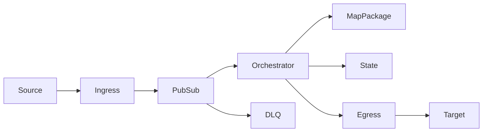
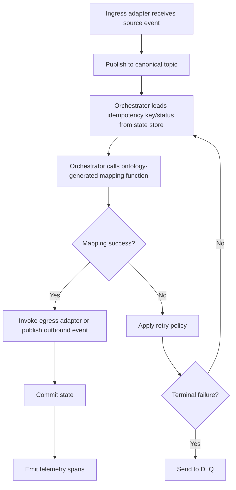
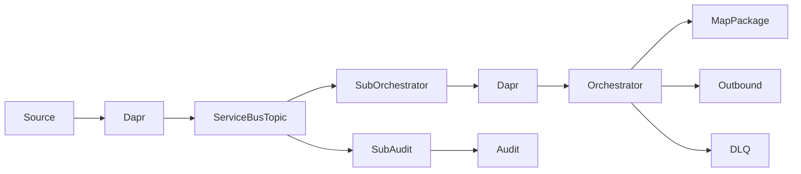

# Kairos for Integration Engineers — A Methodology Guide

> **Audience:** Integration engineers who build API/event workflows and runtime orchestration
> on Dapr, Azure Functions, or similar integration platforms.
>
> This guide explains *what* to design in the ontology hub and *what* to run in runtime repos.

---

## 1. The Big Idea: Separate Design-Time From Runtime

Integration projects often mix two concerns:

- **Design-time**: business concepts, canonical contracts, mapping intent
- **Runtime**: triggers, retries, dead-letter handling, auth, deployment

When those are mixed in one codebase, integration logic becomes hard to evolve safely.

**Kairos separates them by design.**

```text
              Design-time repo                          Runtime repos
         ┌─────────────────────────┐             ┌──────────────────────────┐
         │       Ontology Hub      │   package   │ Integration Platform Repo │
         │  (OWL + mappings + ext) │ ─────────▶  │ (Dapr / Functions apps)   │
         └─────────────────────────┘             └──────────────────────────┘
```

The ontology hub is the source of truth for integration semantics. Runtime repos execute
those semantics under operational constraints.

---

## 2. Why an Ontology Hub for Integration Work

As an integration engineer, you need stable meaning across many systems:

- CRM says `account_id`, ERP says `customerNumber`, billing says `debtorCode`
- Events and APIs drift over time
- One flow fix can unintentionally break another flow

The ontology hub gives one canonical business layer that all integrations map to.

| Without ontology hub | With ontology hub |
|---|---|
| Point-to-point mappings per flow | Shared canonical model across flows |
| Duplicated transform logic | Reusable mapping definitions |
| Drift detected late in runtime | Drift detected at design-time validation |
| Coupled to one platform implementation | Platform-neutral model; runtime-specific execution |

---

## 3. Ontology Hub = Design-Time Only

The ontology hub is **not** your runtime environment.

It is used to:

- Define canonical entities and properties
- Model source-to-canonical mappings
- Validate consistency and completeness
- Generate consumable integration artifacts

It is **not** used to:

- Host running endpoints
- Execute scheduled/event-driven jobs
- Handle runtime retries, circuit breakers, scaling, secrets

Think of it as a compiler input, not an execution host.

---

## 4. Runtime Repos: Where Integrations Actually Run

Runtime repos are separate repositories, similar to the dataplatform pattern:

- Own deployment, secrets, networking, and observability
- Implement operational behavior (timeouts, retries, poison queues)
- Consume generated integration mapping packages from the ontology hub

Typical runtime options:

- **Dapr-based integration repo**: sidecar building blocks for pub/sub, bindings, state
- **Functions-based integration repo**: event/HTTP functions with platform-managed scaling

Both remain consumers of ontology-defined integration semantics.

---

## 5. Template-First Runtime Repositories

Use a standard runtime template per platform (Dapr or Functions) so teams start consistently.

A runtime template should include:

- App skeleton and deployment manifests
- Environment configuration and secret references
- CI/CD pipeline
- Observability defaults (logs, traces, metrics)
- Package consumption hook for ontology-generated integration maps

This mirrors how dataplatform repos consume ontology dbt outputs through a standard mechanism.

---

## 6. Dapr Runtime Reference Architecture

A Dapr-based integration runtime repo typically has these building blocks:

- **Adapter apps** (ingress/egress): isolate source-specific protocols
- **Orchestrator app**: coordinates flow steps and calls mapping package functions
- **Dapr sidecar** per app: pub/sub, state, secret store, service invocation
- **State store**: idempotency keys, checkpoint state, saga progress
- **Pub/Sub broker + DLQ**: decoupled event handling with poison-message routing
- **Observability stack**: traces/metrics/logs correlated by Dapr trace context



### Suggested repo structure (Dapr template)

```text
integration-runtime-dapr/
├── apps/
│   ├── ingress-adapter/
│   ├── orchestrator/
│   └── egress-adapter/
├── packages/
│   └── integration-maps/          # pulled artifact (pinned version)
├── dapr/
│   ├── components/                # pubsub, statestore, secretstore, bindings
│   └── subscriptions/             # topic routing rules
├── deploy/
│   ├── bicep|terraform/
│   └── k8s|containerapps/
└── .github/workflows/
```

---

## 7. Dapr Message Lifecycle (Canonical Flow)

The runtime flow should be predictable and replay-safe:

1. Ingress adapter receives source event and publishes to canonical topic
2. Orchestrator loads idempotency key/status from state store
3. Orchestrator calls ontology-generated mapping function from package
4. On success, orchestrator invokes egress adapter or publishes outbound event
5. State is committed and telemetry spans are emitted
6. On failure, retry policy applies; terminal failures go to DLQ



---

## 8. Example: Dapr + Service Bus Event Layer

If your runtime platform is Azure-centric, use **Azure Service Bus** as the event backbone
under Dapr pub/sub. Dapr keeps app code broker-agnostic while Service Bus provides durable,
enterprise-grade messaging.



### Dapr pub/sub component (Service Bus)

```yaml
apiVersion: dapr.io/v1alpha1
kind: Component
metadata:
  name: canonical-pubsub
spec:
  type: pubsub.azure.servicebus.topics
  version: v1
  metadata:
    - name: connectionString
      secretKeyRef:
        name: servicebus-connection-string
        key: value
    - name: consumerID
      value: integration-runtime
auth:
  secretStore: integration-secretstore
```

### Subscription example (orchestrator route)

```yaml
apiVersion: dapr.io/v2alpha1
kind: Subscription
metadata:
  name: canonical-events-orchestrator
spec:
  pubsubname: canonical-pubsub
  topic: canonical-events
  routes:
    default: /events/canonical
scopes:
  - orchestrator
```

### Event contract example

Use canonical event names and payloads aligned to ontology classes/properties:

```json
{
  "eventType": "OrderReceived",
  "eventVersion": "1.0",
  "correlationId": "9d9f4d9f-6f1a-46e2-8a66-2d6c84d2c9f2",
  "occurredAt": "2026-06-10T14:00:00Z",
  "payload": {
    "orderId": "SO-100245",
    "customerId": "C-8821",
    "orderDate": "2026-06-10",
    "totalAmount": 349.95,
    "currency": "EUR"
  }
}
```

In this pattern, Service Bus handles delivery durability and fan-out, while Dapr handles
application-facing pub/sub APIs. The mapping package remains the semantic translation layer
between source events and canonical payload contracts.

---

## 9. Integration Map Packages (Like `dbt deps`, but for Integrations)

For data platforms, generated dbt logic is consumed via package dependency management.
For integration platforms, use the same principle:

1. Ontology hub generates/version-tags integration map artifacts
2. Runtime repo declares dependency on a specific map package revision
3. Build/deploy pipeline pulls that revision into the runtime project
4. Runtime executes orchestrations using imported map logic

Result: map logic is versioned and centrally governed, while runtime behavior stays local.

---

## 10. Recommended Ownership Split

| Concern | Ontology hub (design-time) | Runtime repo (execution-time) |
|---|---|---|
| Canonical domain semantics | ✅ | ❌ |
| Source-to-canonical mapping intent | ✅ | ❌ |
| Mapping package generation | ✅ | ❌ |
| Trigger wiring and orchestration | ❌ | ✅ |
| Error handling and retries | ❌ | ✅ |
| Infra, secrets, deployment | ❌ | ✅ |
| Runtime SLA/SLO operations | ❌ | ✅ |

This split avoids putting operational concerns into ontology files and avoids duplicating
semantic logic in each runtime implementation.

---

## 11. Methodology Sequence for Integration Engineers

```text
Step 1: Model canonical concepts in ontology hub
        ↓
Step 2: Define/validate source-to-canonical integration mappings
        ↓
Step 3: Generate versioned integration mapping package(s)
        ↓
Step 4: Consume package in runtime repo template (Dapr/Functions)
        ↓
Step 5: Implement runtime orchestration and policies
        ↓
Step 6: Deploy, monitor, and iterate by updating ontology + package version
```

---

## 12. Why This Pattern Scales

- **Consistency**: every runtime uses the same canonical mapping semantics
- **Safety**: semantic changes are reviewed at design-time before runtime rollout
- **Reuse**: one map package can serve multiple flows/apps
- **Controlled upgrades**: runtime repos pin versions and upgrade deliberately
- **Platform flexibility**: move between Dapr and Functions without redefining business meaning

---

## 13. Practical Governance Rules

- Treat ontology hub outputs as published artifacts (versioned, immutable per release)
- Treat runtime repos as consumers that choose when to upgrade
- Never patch generated map logic directly in runtime repo; override via extension hooks only
- Keep operational policies (retry/backoff/idempotency) in runtime code, not in ontology definitions

---

## 14. Mental Model to Keep

> **Ontology hub defines WHAT integration means at design-time.**
>
> **Runtime repos define HOW and WHEN integration executes in production.**
>
> Together, they create a clean contract: stable semantics + independent operations.
